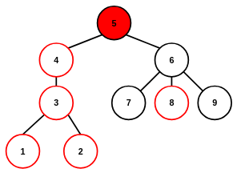
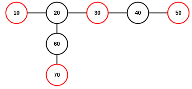

# 1.1 트리DP
## A: 트리와 쿼리
#### 풀이
[15681.c](../OJ2026W/15681.c)  
리루팅  
루트로 지정된 노드 기준 리루팅 후 노드별 서브트리 노드 개수 쿼리  
```C
// struct graph
    int* subs; // dp 테이블(서브트리 개수): 0으로 초기화  

// main()
    dfs(&g,r); // 리루팅 노드에서 DFS 1회

// dfs()
    g->subs[s]=1; // 1: 자신을 개수에 포함시킴
    while(d!=-1){
        // 자식 DFS가 리턴하며 서브트리 노드 개수 갱신
        if(g->vist[g->pool[d].v]==NO){g->subs[s]+=dfs(g,g->pool[d].v);}
        d=g->pool[d].next;
    }
    return g->subs[s];
```
#### 입력
n: 노드 수  
r: 리루팅 노드  
q: 쿼리 수  
#### 입력 예제  


```
$ ./test > test.txt
9 5 3
1 3
4 3
5 4
5 6
6 7
2 3
9 6
6 8
5
4
8

$ cat test.txt
9
4
1
```
## B: 우수 마을
#### 풀이
[1949.c](../OJ2026W/1949.c)  
노드 가중치, 이진 상태공간  
우수 마을끼리 인접할 수 없음  
우수 마을이 아닌 마을은 적어도 하나의 우수 마을과 인접해야 함  
```C
// struct graph
    int* cost; // 노드 가중치
    int** dp;  // [N][2] DP 테이블 - 선정/미선정에 따른 서브트리 노드 가중치 총합
    int* _dp;

// main()
    // 아무 지점에서 재귀 DFS 1회 수행
    // DFS 시작점 DP값 중 큰 값 출력
    dfs(&g,1);
    printf("%d",(g.dp[1][0]>g.dp[1][1])?g.dp[1][0]:g.dp[1][1]);

// dfs()
    g->dp[u][0]=0;          // 선정되지 않음
    g->dp[u][1]=g->cost[u]; // 선정됨(노드 가중치 더함)
    while(d!=-1){
        v=g->pool[d].v;
        if(g->vist[v]==NO){
            dfs(g,v);
            g->dp[u][0]+=(g->dp[v][0]>g->dp[v][1])?(g->dp[v][0]):(g->dp[v][1]);
            g->dp[u][1]+=g->dp[v][0];
        }
        d=g->pool[d].next;
    }
```
#### 입력
노드 수, 노드 가중치 정보, 간선 정보  
#### 입력 예제
```
$ ./test > test.txt
7
1000 3000 4000 1000 2000 2000 7000
1 2
2 3
4 3
4 5
6 2
6 7

$ cat test.txt
14000
```
## C: 트리의 독립집합
#### 풀이
[2213.c](../OJ2026W/2213.c)  
노드 가중치, 역추적  
트리의 독립집합: 노드의 부분집합, 모든 엘리먼트간 간선 없음  
노드 가중치 없음: 독립집합 엘리먼트 수 최대화  
노드 가중치: 독립집합 엘리먼트 가중치 합 최대화  
```C
// struct graph
    int* cost; // 노드 가중치
    int** dp; // [N][2]
    int* _dp;

// 역추적
int* a; // 정답열
int  i; // 정답열 인덱스


// main()
    // DP
    dfs(&g,1); // 아무 지점에서 DFS
    printf("%d\n",(g.dp[1][0]>g.dp[1][1])?g.dp[1][0]:g.dp[1][1]);

    // 역추적
    reset(&g); // 방문상태 초기화
    backtrack(&g,1,0);
    
// dfs()
    g->dp[u][0]=0;          // 선택되지 않음
    g->dp[u][1]=g->cost[u]; // 선택됨: 노드 가중치 더함
    while(d!=-1){
        v=g->pool[d].v;
        if(g->vist[v]==NO){
            dfs(g,v);
            g->dp[u][0]+=(g->dp[v][0]>g->dp[v][1])?(g->dp[v][0]):(g->dp[v][1]);
            g->dp[u][1]+=g->dp[v][0];
        }
        d=g->pool[d].next;
    }

// backtrak()
    int t; // 임시 플래그
    g->vist[u]=OK;
    if((f==0)&&(g->dp[u][1]>g->dp[u][0])){a[i++]=u; t=1;}
    else                                           {t=0;}
    while(d!=-1){
        v=g->pool[d].v;
        if(g->vist[v]==NO){backtrack(g,v,t);}
        d=g->pool[d].next;
    }
```
#### 입력
노드 수, 노드 가중치 정보, 간선 정보  
#### 입력 예제
  

```
$ ./test > test.txt
7
10 30 40 10 20 20 70
1 2
2 3
4 3
4 5
6 2
6 7

$ cat test.txt
140
1 3 5 7 
```
<!-- ## D: 트리 색칠하기 -->
## F: 엠마도 바리스타
#### 풀이
[15647.c](../OJ2026W/15647.c)  
리루팅, 모든 노드로의 최단거리 합  
```C
// struct graph
    int* pare; // 부모: -1로 초기화
    int* size; // 서브트리 사이즈: 0으로 초기화
    long long int* dp1; // DP 테이블
    long long int* dp2; // DP 테이블: 리루팅 DFS

// main()
    dfs(&g,1); reset(&g);
    reroot(&g,1); // 방문 상태 초기화
    for(j=1;j<=n;j++){printf("%lld\n",g.dp1[j]+g.dp2[j]);}

// dfs()
    g->size[u]=1;
    g->dp1[u]=0;
    while(d!=-1){
        v=g->pool[d].v;
        if(g->vist[v]==NO){
            g->pare[v]=u;
            dfs(g,v);
            g->size[u]+=g->size[v];
            g->dp1[u] +=(g->dp1[v]+(long long int)g->size[v]*g->pool[d].w);
        }
        d=g->pool[d].next;
    }
// reroot()
    while(d!=-1){
        v=g->pool[d].v;
        if(g->vist[v]==NO){
            g->dp2[v]= (g->dp1[u]+g->dp2[u])-(g->dp1[v]+(long long int)g->size[v]*g->pool[d].w);
            g->dp2[v]+=(long long int)((g->n-1)-g->size[v])*g->pool[d].w;
            reroot(g,v);
        }
        d=g->pool[d].next;
    }
```
#### 입력
노드 개수, 간선 정보  
#### 입력 예제
```
$ ./test.txt > test.txt
10
1 2 1
2 3 1
2 4 1
4 7 1
4 8 1
4 5 1
1 6 1
6 9 1
6 10 1

$ cat test.txt
19
17
25
19
27
23
27
27
31
31
```
<!-- ## G: 트리와 XOR -->


## 1.2 비트DP