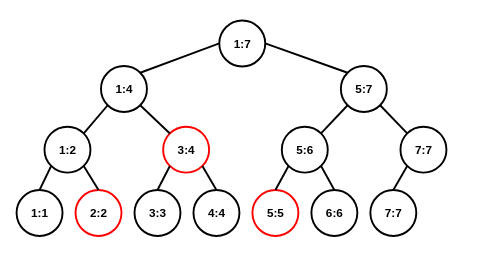
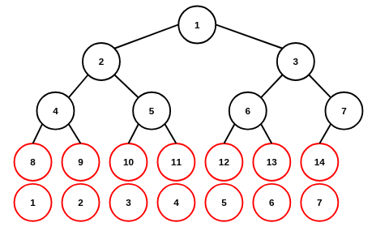

# 3장 트리
## 3.1 트리 구현및 탐색
### 3.1.1 트리 구현
#### 선형이진트리
|노드|선형 인덱스|
|---|---|
|root|1|
|parent(i)|$\lfloor i/2\rfloor$|
|leftchild(i)|$i\times2$|
|rightchild(i)|$i\times2+1$|

```C
struct tree{
    int  n; // number of item
    int* a; // array: 선형 트리
};
```
#### 연결다진트리
```C
struct tree{
    struct node* r; // root
};
struct node{
    struct node** c; // child
};
```
### 3.2.1 트리 탐색: 선형이진트리
#### DFS: 재귀
```C
#include<stdio.h>
#include<stdlib.h>

struct tree{
    int n;
    int* a;
};

void   dfs(struct tree* t,int r);

int main(void){
    int j;
    int n; scanf("%d",&n);
    int r; scanf("%d",&r);
    int* a=(int*)malloc(sizeof(int)*(n+1)); // n+1: 1부터 시작하는 선형이진트리 인덱스
    struct tree t;
    t.n=n;
    t.a=&a[0];
    for(j=1;j<=n;j++){scanf("%d",&a[j]);}
    printf("dfs: "); dfs(&t,1);
    free(a);
}

void   dfs(struct tree* t,int r){
    if(r>t->n){return;}
    printf("%d ",t->a[r]); // preorder
    dfs(t,2*r);  // lchild
    dfs(t,2*r+1);// rchild
}
```
```
$ ./test
7 # number of node
1 # start
1 2 3 4 5 6 7
dfs: 1 2 4 5 3 6 7 
```
#### DFS: 스택
```C
void   dfs(struct tree* t,int r){
    int d;
    int* s=(int*)malloc(sizeof(int)*(t->n+1)); // stack
    int h=0; // top of stack
    s[h++]=r; // push
    while(h>0){
        d=s[--h]; // pop
        printf("%d ",t->a[d]);
        if(2*d+1<=t->n){s[h++]=2*d+1;} // push rchild
        if(2*d  <=t->n){s[h++]=2*d;}   // push lchild
    }
    free(s);
}
```
#### BFS: 큐
```C
void   bfs(struct tree* t,int r){
    int d;
    int* q=(int*)malloc(sizeof(int)*(t->n+1)); // queue
    int s=0; // front of queue
    int e=0; // rear of queue
    q[e++]=r; // enqueue
    while(s<e){
        d=q[s++]; // dequeue
        printf("%d ",t->a[d]);
        if(2*d  <=t->n){q[e++]=2*d;}   // enqueue lchild
        if(2*d+1<=t->n){q[e++]=2*d+1;} // dequeue rchild
    }
    free(q);
}
```
#### BFS: 배열 출력
루트에서만 동작함  
```
            1
    2               3
4       5       6       7
(...)
```
```C
void   bfs(struct tree* t){
    int j;
    for(j=1;j<=t->n;j++){o=printf("%d ",t->a[j]);}
}
```


## 3.2 포인트 쿼리
### 3.2.1 힙
#### 힙(최대 힙)
최소 힙: heapify 부등호 방향 토글  
```C
#include<stdio.h>
#include<stdlib.h>

struct heap{
    int* a;
    int  n;
};

void push(struct heap* h,int v);
int   pop(struct heap* h);

int main(void){
    int j;
    int n; scanf("%d",&n);
    int v;
    struct heap h;
    h.a=(int*)malloc(sizeof(int)*(n+1));
    h.n=0;
    for(j=0;j<n;j++){scanf("%d",&v); push(&h,v);}
    for(j=0;j<n;j++){printf("%d ",pop(&h));}
    free(h.a);
}

void push(struct heap* h,int v){
    int i=++(h->n); // index of tree
    int t;          // temp variable: swap
    
    h->a[i]=v;      // 마지막 엘리먼트로 삽입 후 heapify up
    while((i>1)&&(h->a[i]>h->a[i/2])){
        t=h->a[i];
        h->a[i]=h->a[i/2];
        h->a[i/2]=t;
        i/=2;
    }
}
int pop(struct heap* h){
    int r=h->a[1]; // return value
    int i=1;       // index of tree
    int t;         // temp variable(swap)
    int c;         // child

    h->a[i]=h->a[(h->n)--]; // 루트 덮어쓰기 후 heapify down
    while(i*2<=h->n){
        if((i*2+1<=h->n)&&(h->a[i*2+1]>h->a[i*2])){c=i*2+1;} // rchild
        else                                      {c=i*2;}   // lchild
        if(h->a[i]>=h->a[c]){break;}
        t=h->a[i];
        h->a[i]=h->a[c];
        h->a[c]=t;
        i=c;
    }
    return r;
}
```
```
$ ./test
9
1 3 2 7 8 9 6 4 5
9 8 7 6 5 4 3 2 1 
```
### 3.2.2 이진탐색트리
#### 기본 BST
입력 예제  
```
            8
    3               10
2       5               14
                    11      16
```
```C
#include<stdio.h>
#include<stdlib.h>

struct node{
    int v;
    struct node* l;
    struct node* r;
};
struct tree{
    struct node* root;
};

struct node* search(struct tree* t,int v); // 성공: 노드 주소, 실패: NULL
int          insert(struct tree* t,int v); // 실패: -1(중복 노드 삽입 시도)
int          delete(struct tree* t,int v); // 실패: -1

int main(void){
    int j;
    int n; int q; scanf("%d %d",&n,&q);
    int o; int v;
    struct tree t;

    // 트리 초기화
    t.root=(struct node*)malloc(sizeof(struct node));
    scanf("%d",&t.root->v);
    t.root->l=NULL;
    t.root->r=NULL;
    for(j=1;j<n;j++){scanf("%d",&v); insert(&t,v);}

    // 포인트 쿼리
    for(j=0;j<q;j++){
        scanf("%d %d",&o,&v);
        if(o==1){printf("search(%d): %d\n",v,(search(&t,v)==NULL)?(-1):(1));}
        if(o==2){printf("insert(%d): %d\n",v,insert(&t,v));}
        if(o==3){printf("delete(%d): %d\n",v,delete(&t,v));}
    }
}

struct node* search(struct tree* t,int v){
    struct node* b=t->root;
    while(b!=NULL){
        if(v==b->v){return b;}
        if(v<b->v){b=b->l;}
        else      {b=b->r;}
    }
    return b; // NULL
}
int insert(struct tree* t,int v){
    struct node* b=t->root;
    struct node* p=b; // parent
    while(b!=NULL){
        if     (v< b->v){p=b; b=b->l;}
        else if(v==b->v){return -1;} // 중복 엘리먼트 삽입
        else            {p=b; b=b->r;}
    }
    struct node* n=(struct node*)malloc(sizeof(struct node)); // new
    n->v=v;
    n->l=NULL;
    n->r=NULL;
    if(v<p->v){p->l=n;}
    else      {p->r=n;}
    return 0; // 성공
}
int delete(struct tree* t,int v){
    struct node* b=t->root;
    struct node* p=b; // parent
    while(b!=NULL){
        if     (v< b->v){p=b; b=b->l;}
        else if(v==b->v){break;}
        else            {p=b; b=b->r;}
    }
    if(b==NULL){return -1;} // 실패(노드 없음)
    if((b->l==NULL)&&(b->r==NULL)){ // 터미널
        if((p->l!=NULL)&&(p->l==b)){p->l=NULL;}
        else                       {p->r=NULL;}
    }
    else if((b->l==NULL)||(b->r==NULL)){ // 서브 트리 1개
        if((p->l!=NULL)&&(p->l==b)){p->l=(b->l!=NULL)?b->l:b->r;}
        else                       {p->r=(b->l!=NULL)?b->l:b->r;}
    }
    else{   //서브트리 2개: 좌측 서브 트리 최소값 또는 우측 서브 트리 최대값를 루트(후임)로
        struct node* f=b;    // parent of successor
        struct node* s=b->r; // successor
        while(s->l!=NULL){f=s; s=s->l;}
        b->v=s->v; // 덮어씀
        if(b==f){f->r=s->r;} // 서브트리 루트가 후임
        else    {f->l=s->r;} // 일반적인 경우(후임 노드 우측 서브트리 편입)
    }
    return 0;
}
```
```
$ ./test > test.txt
8 5 # number of node, query
8 3 10 2 5 14 11 16
1 7
2 7
1 7
3 7
1 7

$ cat test.txt
search(7): -1
insert(7): 0
search(7): 1
delete(7): 0
search(7): -1
```
<!-- #### AVL트리 -->
<!-- #### RB트리 -->


## 3.3 구간 쿼리
### 3.3.1 구간 쿼리
#### 세그먼트트리 입력 예제
구간 [2,5] 쿼리시((2<=s)&&(e<=5))을 만족하는 노드  


#### 완전이진트리 성질
부모 노드: $\mathrm{parent}(i)=\lfloor i/2 \rfloor$  
원본 배열 길이가 $n$($2^k<n\leq2^{k+1}$)일 때 세그먼트트리 리프 노드: $2^{k+1},2^{k+1}+1, \cdots, 2^{k+1}+(n-1)$  


예제: 원본 배열 길이 $2^2<7\leq2^3$  
세그먼트트리 리프 인덱스: $8\sim14$  
$2^3,2^3+1,\cdots 2^3+(7-1)$  

#### 구간합 세그먼트트리
```C
#include<stdio.h>
#include<stdlib.h>

int* a; // 원본 배열
int* t; // 세그먼트트리

void  build(int n,int s,int e);
void update(int n,int s,int e,int i,int v);
int   query(int n,int s,int e,int l,int r);

int main(void){
    int j;
    int n; int m; scanf("%d %d",&n,&m);
    int o; int b; int c;
    a=(int*)malloc(sizeof(int)*(n+1));
    t=(int*)malloc(sizeof(int)*(n+1)*4);
    for(j=1;j<=n;j++){scanf("%d",&a[j]);}
    build(1,1,n);

    for(j=0;j<m;j++){
        scanf("%d %d %d",&o,&b,&c);
        if(o==1){update(1,1,n,b,c); a[b]=c;}
        else    {printf("%d\n",query(1,1,n,b,c));}
    }
    free(a);
    free(t);
}

void  build(int n,int s,int e){
    if(s==e){t[n]=a[s]; return;}
    int m=(s+e)/2;
    build(2*n,  s,  m);      // lchild
    build(2*n+1,m+1,e);      // rchild
    t[n]=t[2*n]+t[2*n+1]; // 구간합
}
void update(int n,int s,int e,int i,int v){
    if((i<s)||(e<i)){return;}
    if(s==e){t[n]=v; return;}
    int m=(s+e)/2;
    update(2*n,  s,  m,i,v); // lchild
    update(2*n+1,m+1,e,i,v); // rchild
    t[n]=t[2*n]+t[2*n+1];    // 구간합
}
int   query(int n,int s,int e,int l,int r){
    if((r< s)||(e< l)){return 0;}
    if((l<=s)&&(e<=r)){return t[n];}
    int m=(s+e)/2;
    return query(2*n,s,m,l,r)+query(2*n+1,m+1,e,l,r);
}
```
```
$ ./test > test.txt
7 3 # number of node, query
1 2 3 4 5 6 7 # [*,1,2,3,4,5,6,7]
2 2 5         # 2+3+4+5
1 3 9         # [*,1,2,9,4,5,6,7]
2 2 5         # 2+9+4+5

$ cat  test.txt
14 # 2+3+4+5
20 # 2+9+4+5
```
#### 구간합 세그먼트 트리: 비재귀
완전이진트리 성질을 이용해 반복문 기반으로 구현할 수 있다  
```C
#include<stdio.h>
#include<stdlib.h>

int* a; // 원본 배열
int* t; // 세그먼트트리
int n; // 원본 배열 길이
int k; // 세그먼트트리 리프

void   init(void);
void  clean(void);
void  build(void);
void update(int i,int v);
int   query(int l,int r);

int main(void){
    int j;
    int q;
    int o; int u; int v;
    scanf("%d",&n); init();
    scanf("%d",&q);
    for(j=1;j<=n;j++){scanf("%d",&a[j]);} build();
    for(j=0;j< q;j++){
        scanf("%d %d %d",&o,&u,&v);
        if(o==1){update(u,v);}
        if(o==2){printf("%d\n",query(u,v));}
    }
    clean();
}
void   init(void){
    k=1; while(k<n){k*=2;}
    a=(int*)malloc(sizeof(int)*(n+1));
    t=(int*)malloc(sizeof(int)*(k*2));
}
void  clean(void){
    free(a);
    free(t);    
}
void  build(void){
    int j;
    for(j=1;  j<=n;j++){t[k+(j-1)]=a[j];}
    for(j=n+1;j<=k;j++){t[k+(j-1)]=0;}
    for(j=k-1;j> 0;j--){t[j]=t[2*j]+t[2*j+1];}
}
void update(int i,int v){
    i=k+i-1;
    t[i]=v;
    while(i>1){
        i/=2;
        t[i]=t[2*i]+t[2*i+1];
    }
}
int   query(int l,int r){
    int s=0;
    l+=(k-1);
    r+=(k-1);
    while(l<=r){
        if(l%2==1){s+=t[l++];}
        if(r%2==0){s+=t[r--];}
        l/=2;
        r/=2;
    }
    return s;
}
```
#### 병합정렬트리
부분배열에서 어떤 수보다 큰 원소 개수 출력  
```C
#include<stdio.h>
#include<stdlib.h>

int  a[100001]; // 원본 배열
int* t[400004]; // 병합정렬 트리, int*: 가변 길이 배열 포인터

void  init(int n,int s,int e);
int  query(int n,int s,int e,int l,int r,int q);
int  search(int* b,int n,int q); // 부분배열 이분탐색

int main(void){
    int j;
    int n; int m;
    int u; int v;
    int q; // query

    scanf("%d",&n);
    for(j=0;j<n;j++){scanf("%d",&a[j]);}
    init(1,0,n-1);
    
    scanf("%d",&m);
    for(j=0;j<m;j++){
        scanf("%d %d %d",&u,&v,&q);
        printf("%d\n",query(1,0,n-1,u-1,v-1,q));
    }
}

void init(int n,int s,int e){
    int m; // middle
    int i; int j; int k;
    int L; int R;
    if(s==e){
        t[n]=(int*)malloc(sizeof(int));
        t[n][0]=a[s];
        return;
    }
    m=(s+e)/2;
    init(2*n,  s,  m);
    init(2*n+1,m+1,e);
    t[n]=(int*)malloc(sizeof(int)*(e-s+1));

    // merge
    i=0;j=0;k=0;
    L=m-s+1;
    R=e-m;
    while((i<L)&&(j<R)){
        if(t[2*n][i]<t[2*n+1][j]){t[n][k++]=t[2*n]  [i++];}
        else                        {t[n][k++]=t[2*n+1][j++];}
    }
    while(i<L){t[n][k++]=t[2*n  ][i++];}
    while(j<R){t[n][k++]=t[2*n+1][j++];}
}
int query(int n,int s,int e,int l,int r,int q){
    int m; // middle
    if((l>e)||(r<s)){return 0;}
    if((l<=s)&&(e<=r)){return (e-s+1)-search(t[n],e-s+1,q);}
    m=(s+e)/2;
    return query(2*n,s,m,l,r,q)+query(2*n+1,m+1,e,l,r,q);
}
int search(int* b,int n,int q){
    int s=0;    // start
    int m;      // middle
    int e=n;    // end
    while(s<e){
        m=(s+e)/2;
        if(b[m]<=q){s=m+1;}
        else       {e=m;}
    }
    return s;
}
```
```
$ ./test > test.txt
5 # number of element
5 1 2 3 4
3 # number of query
2 4 1
4 4 4
1 5 2

$ cat test.txt
2
0
3
```
### 3.3.2 구간 업데이트
#### 느리게 갱신되는 세그먼트 트리
구간합 및 구간 업데이트  
```C
#include<stdio.h>
long long int a[1000001]; // 원본 배열
long long int t[4000004]; // 구간합 트리
long long int p[4000004]; // lazy propagtion

void           init(int n,int s,int e);
void           lazy(int n,int s,int e);
void         update(int n,int s,int e,int l,int r,long long int v);
long long int query(int n,int s,int e,int l,int r);

int main(void){
    int j; // loop variable
    int n; int m; int k;
    int o; int b; long long int c; long long int v;

    scanf("%d %d %d",&n,&m,&k);
    for(j=0;j<n;j++){scanf("%lld",&a[j]);}
    init(1,0,n-1);

    for(j=0;j<m+k;j++){
        scanf("%d %d %lld",&o,&b,&c);
        if(o==1){
            scanf("%lld",&v);
            update(1,0,n-1,b-1,(int)c-1,v);
        }
        else{
            printf("%lld\n",query(1,0,n-1,b-1,(int)c-1));
        }
    }
}

void init(int n,int s,int e){
    int m; // middle
    if(s==e){t[n]=a[s]; return;}
    m=(s+e)/2;
    init(2*n,  s,  m);      // lchild
    init(2*n+1,m+1,e);      // rchild
    t[n]=t[2*n]+t[2*n+1]; // 구간합
}
void lazy(int n,int s,int e){
    if(p[n]!=0){
        t[n]+=(long long int)(e-s+1)*p[n];
        if(s!=e){
            p[2*n]  +=p[n];
            p[2*n+1]+=p[n];
        }
        p[n]=0;
    }
}
void update(int n,int s,int e,int l,int r,long long int v){
    int m; // middle
    lazy(n,s,e);
    if((l>e)||(r<s)){return;}
    if((l<=s)&&(e<=r)){
        p[n]+=v;
        lazy(n,s,e);
        return;
    }
    m=(s+e)/2;
    update(2*n,  s,  m,l,r,v);
    update(2*n+1,m+1,e,l,r,v);
    t[n]=t[2*n]+t[2*n+1];
}
long long int query(int n,int s,int e,int l,int r){
    int m; // middle
    lazy(n,s,e);
    if((l>e)||(r<s))  {return 0;}
    if((l<=s)&&(e<=r)){return t[n];}
    m=(s+e)/2;
    return query(2*n,s,m,l,r)+query(2*n+1,m+1,e,l,r);
}
```
```
$ ./test > test.txt
5 1 2 # number of element, query
1 2 3 4 5
2 1 3   # 1+2+3=6
1 1 3 1 # {2,3,4,4,5}
2 1 3   # 2+3+4=9

$ cat test.txt
6
9
```
### 3.3.3 오프라인 쿼리
#### 오프라인 쿼리
```C
#include<stdio.h>
#include<stdlib.h>

struct unode{ // update request
    int       i;
    long long v;
};
struct qnode{ // query
    int i; // 원본 순서
    int k; // 적용된 쿼리 개수(정렬 기준)
    int l;
    int r;
    long long int q; // 쿼리 결과
};

long long int* A; // 원본 배열
long long int* T; // 구간합 트리
struct unode* U; // 업데이트 배열
struct qnode* Q; // 쿼리 배열

void           init(int n,int s,int e);
void         update(int n,int s,int e,int i,long long int v);
long long int query(int n,int s,int e,int l,int r);
int compare_i(const void* x,const void* y); // qsort: 쿼리 순서 오름차순
int compare_k(const void* x,const void* y); // qsort: 쿼리 개수 오름차순

int main(void){
    int j; int p; // loop variable
    int n; int m;
    int o; // operation type
    int u=0; // length of update array
    int q=0; // length of query array

    // 세그먼트 트리 초기화
    scanf("%d",&n);
    A=(long long int*)malloc(sizeof(long long int)*(n+1));
    T=(long long int*)malloc(sizeof(long long int)*(4*(n+1)));
    for(j=0;j<n;j++){scanf("%lld",&A[j]);}
    init(1,0,n-1);

    // 쿼리 배열 초기화
    scanf("%d",&m);
    U=(struct unode*)malloc(sizeof(struct unode)*m);
    Q=(struct qnode*)malloc(sizeof(struct qnode)*m);
    for(j=0;j<m;j++){
        scanf("%d",&o);
        if(o==1){scanf("%d %lld", &U[u].i,&U[u].v);                   u++;}
        else    {scanf("%d %d %d",&Q[q].k,&Q[q].l,&Q[q].r); Q[q].i=q; q++;}
    }
    qsort(&Q[0],q,sizeof(struct qnode),compare_k);

    // 쿼리 수행
    p=0;
    for(j=0;j<q;j++){
        while(p<Q[j].k){update(1,0,n-1,U[p].i-1,U[p].v); A[U[p].i-1]=U[p].v; p++;}
        Q[j].q=query(1,0,n-1,Q[j].l-1,Q[j].r-1);
    }

    // 쿼리 결과 출력
    qsort(&Q[0],q,sizeof(struct qnode),compare_i); // 쿼리 순서 복원
    for(j=0;j<q;j++){printf("%lld\n",Q[j].q);}
}

void init(int n,int s,int e){
    int m; // middle
    if(s==e){T[n]=A[s]; return;}
    m=(s+e)/2;
    init(2*n,  s,  m);      // lchild
    init(2*n+1,m+1,e);      // rchild
    T[n]=T[n*2]+T[n*2+1]; // 구간합
}
void update(int n,int s,int e,int i,long long v){
    int m; // middle
    if((i<s)||(i>e)){return;}
    if(s==e){T[n]=v; return;}
    m=(s+e)/2;
    update(2*n,  s,  m,i,v); // lchild
    update(2*n+1,m+1,e,i,v); // rchild
    T[n]=T[n*2]+T[n*2+1];    // 구간합
}
long long query(int n,int s,int e,int l,int r){
    int m; // middle
    if((l>e)||(r<s))    {return 0;}
    if(((l<=s)&&(e<=r))){return T[n];}
    m=(s+e)/2;
    return query(2*n,s,m,l,r)+query(2*n+1,m+1,e,l,r);
}
int compare_i(const void* x,const void* y){
    if((((struct qnode*)x)->i)<(((struct qnode*)y)->i)){return -1;}
    if((((struct qnode*)x)->i)>(((struct qnode*)y)->i)){return  1;}
    return 0;
}
int compare_k(const void* x,const void* y){
    if((((struct qnode*)x)->k)<(((struct qnode*)y)->k)){return -1;}
    if((((struct qnode*)x)->k)>(((struct qnode*)y)->k)){return  1;}
    return 0;
}
```
#### mo's
```C
#include<stdio.h>
#include<stdlib.h>

struct query{
    int i; // 순서 원본
    int l;
    int r;
};

int B;
int A[1000001]; // 원본 배열
int C[1000001]; // count
int R[1000001]; // result
int I = 0;
struct query Q[100001];

int compare(const void* a, const void* b);

int main(void){
    int j;
    int n;   int m;
    int l=1; int r=0;
    int s;   int e;

    scanf("%d",&n);
    B=1; while(B*B<=n){B++;} B--; // sqrt(n)
    for(j=1;j<=n;j++){scanf("%d",&A[j]);}

    scanf("%d",&m);
    for(j=0;j<m;j++){Q[j].i=j;scanf("%d %d",&Q[j].l,&Q[j].r);}
    qsort(&Q[0],m,sizeof(struct query),compare);
    
    for(j=0;j<m;j++){
        s=Q[j].l;
        e=Q[j].r;
        while(l>s){if((  C[A[--l]]++)==0){I++;}}
        while(r<e){if((  C[A[++r]]++)==0){I++;}}
        while(l<s){if((--C[A[l++]]  )==0){I--;}}
        while(r>e){if((--C[A[r--]]  )==0){I--;}}
        R[Q[j].i]=I;
    }
    
    for(j=0;j<m;j++){printf("%d\n",R[j]);}
}
int compare(const void* a,const void* b){
    if((((struct query*)a)->l/B)!=(((struct query*)b)->l/B)){
    return (((struct query*)a)->l/B)-(((struct query*)b)->l/B);}
    if((((struct query*)a)->l/B)%2==0){
    return (((struct query*)a)->r)-  (((struct query*)b)->r);}
    return (((struct query*)b)->r)-  (((struct query*)a)->r);
}
```