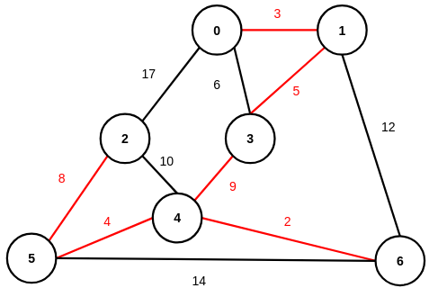
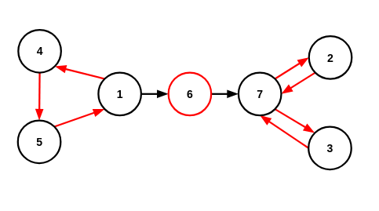

# 4장 그래프
## 4.1 그래프 구현 및 탐색
### 4.1.1 그래프 구현
#### 인접행렬
```C
struct graph{
    int** adjs;
};
```
#### 격자그래프
```C
struct graph{
    int** adjs;
};
```
#### 인접리스트
```C
struct node{
    int v;
    int w;
    struct node* next;
};
struct graph{
    int n;
    struct node** adjs;
};
```
#### 정적간선풀
```C
#include<stdio.h>
#include<stdlib.h>

struct node{
    int v;
    int w;
    int next;
};
struct graph{
    int n; // number of node
    int e; // number of edge
    int p; // pool index
    int*         adjs;
    struct node* pool;
};

void   init(struct graph* g,int n,int e);
void  clean(struct graph* g);
void insert(struct graph* g,int u,int v,int w);

int main(void){
    int j;
    int n; int e;scanf("%d %d",&n,&e);
    int u; int v; int w;
    struct graph g;
    init(&g,n,e);
    for(j=0;j<e;j++){scanf("%d %d %d",&u,&v,&w);insert(&g,u,v,w);}
    clean(&g);
}

void   init(struct graph* g,int n,int e){
    int j;
    g->n=n;
    g->e=e;
    g->p=0;
    g->adjs=(int*)malloc(sizeof(int)*n);
    g->pool=(struct node*)malloc(sizeof(struct node)*e);
    for(j=0;j<n;j++){g->adjs[j]=-1;}
}
void  clean(struct graph* g){
    free(g->adjs);
    free(g->pool);
}
void insert(struct graph* g,int u,int v,int w){
    g->pool[g->p].v=v;
    g->pool[g->p].w=w;
    g->pool[g->p].next=g->adjs[u];
    g->adjs[u]=(g->p)++;
}
```
### 4.1.2 그래프 탐색
#### 인접행렬 거듭제곱
$\mathbf{A}^k_{i,j}$: 노드 $i$에서 $j$로 $k$개의 간선을 거치는 경로 개수(unweighted graph)  
$\because\mathbf{A}\mathbf{A}_{i,j}=\displaystyle\sum_{m=0}^{n-1}\mathbf{A}_{i,m}\times\mathbf{A}_{m,j}$  
#### DFS


#### DFS: 재귀
```C
#include<stdio.h>
#include<stdlib.h>

#define NO 0
#define OK 1

struct node{
    int v;
    int next;
};
struct graph{
    int n;
    int e;
    int p;
    int*         adjs;
    int*         vist;
    struct node* pool;
};

void    dfs(struct graph* g,int s);
void   init(struct graph* g,int n,int e);
void  clean(struct graph* g);
void insert(struct graph* g,int u,int v);

int main(void){
    int j;
    int n; int e; scanf("%d %d",&n,&e);
    int s;        scanf("%d",&s);
    int u; int v;
    struct graph g;
    init(&g,n,2*e); // 2*e: 무향그래프
    for(j=0;j<e;j++){
        scanf("%d %d",&u,&v);
        insert(&g,u,v);
        insert(&g,v,u);
    }
    dfs(&g,s);
    clean(&g);
}

void    dfs(struct graph* g,int s){
    int d;
    printf("%d ",s);
    d=g->adjs[s];
    g->vist[s]=OK;
    while(d!=-1){
        if(g->vist[g->pool[d].v]==NO){dfs(g,g->pool[d].v);}
        d=g->pool[d].next;
    }
}
void   init(struct graph* g,int n,int e){
    int j;
    g->n=n;
    g->e=e;
    g->p=0;
    g->adjs=(int*)malloc(sizeof(int)*n);
    g->vist=(int*)malloc(sizeof(int)*n);
    g->pool=(struct node*)malloc(sizeof(struct node)*e);
    for(j=0;j<n;j++){
        g->adjs[j]=-1;
        g->vist[j]=NO;
    }
}
void  clean(struct graph* g){
    free(g->adjs);
    free(g->vist);
    free(g->pool);
}
void insert(struct graph* g,int u,int v){
    g->pool[g->p].v=v;
    g->pool[g->p].next=g->adjs[u];
    g->adjs[u]=g->p++;
}
```
```
$ ./test
5 8 # number of node, edge
0   # start
0 1
0 2
0 4
1 2
1 3
2 3
2 4
3 4
0 4 3 2 1
```
#### DFS: 스택
```C
void    dfs(struct graph* g,int s){
    int  d;
    int* a=(int*)malloc(sizeof(int)*(g->n)); // stack
    int  t=0; // top of stack
    a[t++]=s; // push
    g->vist[s]=OK;
    while(t>0){
        d=a[--t]; printf("%d ",d); // pop
        d=g->adjs[d];
        while(d!=-1){
            if(g->vist[g->pool[d].v]==NO){
                g->vist[g->pool[d].v]=OK;
                a[t++]=g->pool[d].v; // push
            }
            d=g->pool[d].next;
        }
    }
    free(a);
}
```
```
$ ./test
5 8 # number of node, edge
0   # start
0 1
0 2
0 4
1 2
1 3
2 3
2 4
3 4
0 1 3 2 4
```
#### BFS


#### BFS: 큐
```C
void    bfs(struct graph* g,int s){
    int  d;
    int* q=(int*)malloc(sizeof(int)*(g->n));
    int f=0;
    int r=0;
    q[r++]=s; // enqueue
    g->vist[s]=OK;
    while(f<r){
        d=q[f++]; printf("%d ",d); // dequeue
        d=g->adjs[d];
        while(d!=-1){
            if(g->vist[g->pool[d].v]==NO){
                g->vist[g->pool[d].v]=OK;
                q[r++]=g->pool[d].v; // enqueue
            }
            d=g->pool[d].next;
        }
    }
    free(q);
}
```
```
$ ./test
5 8 # number of node, edge
0   # start
0 1
0 2
0 4
1 2
1 3
2 3
2 4
3 4
bfs: 0 4 2 1 3
```
### 4.1.3 격자그래프 탐색
#### BFS
```C

#include<stdio.h>
#include<stdlib.h>

struct node{
    int r;
    int c;
};
struct graph{
    int n;
    int m;
    int** grid;
    int** dist;
    int*  data;
    int*  zero;
};

void   bfs(struct graph* g,int r,int c);
void  init(struct graph* g,int n,int m);
void clean(struct graph* g);

int main(void){
    int j; int k;
    int n; int m; scanf("%d %d",&n,&m);
    struct graph g;

    init(&g,n,m);
    for(j=0;j<n;j++){for(k=0;k<m;k++){
        scanf("%1d",&g.grid[j][k]);
        g.dist[j][k]=0;
    }}

    bfs(&g,0,0);
    if(g.dist[n-1][m-1]==0){printf("-1");}
    else                   {printf("%d",g.dist[n-1][m-1]);}
}

void   bfs(struct graph* g,int r,int c){
    int j;
    struct node d[4]={{-1,0},{1,0},{0,-1},{0,1}}; // directions
    struct node* q=(struct node*)malloc(sizeof(struct node)*(g->n*g->m+1)); // queue
    int s=0;                                                                // front of queue
    int e=0;                                                                // rear  of queue
    struct node u; // current node
    struct node v; // next node

    q[e  ].r=r; // enqueue
    q[e++].c=c; // enqueue
    g->dist[r][c]=1;
    while(s<e){
        u.r=q[s  ].r; // dequeue
        u.c=q[s++].c; // dequeue
        for(j=0;j<4;j++){
            v.r=u.r+d[j].r;
            v.c=u.c+d[j].c;
            if(((0<=v.r)&&(v.r<g->n))&&((0<=v.c)&&(v.c<g->m))){
            if((g->grid[v.r][v.c]==0)&&(g->dist[v.r][v.c]==0)){
                g->dist[v.r][v.c]=g->dist[u.r][u.c]+1; // 거리 갱신
                q[e  ].r=v.r; // enqueue
                q[e++].c=v.c; // enqueue
            }}
        }
    }
}
void  init(struct graph* g,int n,int m){
    int j; int k=0;
    g->n=n;
    g->m=m;
    g->grid=(int**)malloc(sizeof(int*)*n);
    g->dist=(int**)malloc(sizeof(int*)*n);
    g->data=(int*) malloc(sizeof(int)* n*m);
    g->zero=(int*) malloc(sizeof(int)* n*m);
    for(j=0;j<n;j++){
        g->grid[j]=g->data+k;
        g->dist[j]=g->zero+k;
        k+=m;
    }
}
void clean(struct graph* g){
    free(g->data);
    free(g->zero);
    free(g->grid);
    free(g->dist);
}
```
```
$ ./test
6 4
0000
1110
1000
0000
0111
0000
15
```
```
$ ./test
4 4
0100
1100
0000
0000
-1
```


## 4.2 가중치그래프 최적해
### 4.2.1 최단경로
#### 최단경로 예제


#### 데이크스트라
시작점: A  
|S|A|B|C|D|E||
|---|---|---|---|---|---|---|
|$S=\{\}$|**0**|$\infty$|$\infty$|$\infty$|$\infty$|초기화|
|$S=\{A\}$|0|**10**|**5**|$\infty$|$\infty$|B: $\min(\infty,0+10)$<br>C: $\min(\infty,0+5)$|
|$S=\{A,C\}$|0|**8**|5|**14**|**7**|B: $\min(10,5+3)$<br>D: $\min(\infty,5+9)$<br>E: $\min(\infty,5+2)$|
|$S=\{A,C,E\}$|0|8|5|**13**|7|D: $\min(14,7+6)$|
|$S=\{A,C,E,B\}$|0|8|5|**9**|7|C: $\min(5,8+2)$<br>D: $\min(13,8+1)$|
|$S=\{A,C,E,B,D\}$|0|8|5|9|7|E: $\min(7,9+4)$|
#### 데이크스트라: 힙, 역추적
```C
#include<stdio.h>
#include<stdlib.h>

#define INF 1000000

struct hode{
    int v;
    int d;
};
struct node{
    int v;
    int w;
    int next;
};
struct graph{
    int n;
    int*         adjs;
    int*         dist;
    int*         pare; // 역추적
    struct hode* heap;
    struct node* pool;
    int i; // number of heap item
    int p; // pool index
};

void   dijkstra(struct graph* g,int s); // src
void  backtrack(struct graph* g,int d); // dst
void       init(struct graph* g,int n,int e);
void      clean(struct graph* g);
void     insert(struct graph* g,int u,int v,int w);
void       push(struct graph* g,int v,int d);
struct hode pop(struct graph* g);

int main(void){
    int j;
    int n; int e; scanf("%d %d",&n,&e);
    int s; scanf("%d",&s);
    int u; int v; int w;
    static struct graph g;
    init(&g,n,e);
    for(j=0;j<e;j++){scanf("%d %d %d",&u,&v,&w);insert(&g,u,v,w);}
    dijkstra(&g,s);
    for(j=0;j<n;j++){
        printf("cost(%d to %d): %d\t",s,j,g.dist[j]);
        printf("path: "); backtrack(&g,j);
        printf("\n");
    }
    clean(&g);
}

void   dijkstra(struct graph* g,int s){
    struct hode h;
    int n;
    g->dist[s]=0;
    push(g,s,0);
    while(g->i>0){
        h=pop(g);
        if(g->dist[h.v]<h.d){continue;} // push 이후 갱신: continue
        n=g->adjs[h.v];
        while(n!=0){
            if(g->dist[h.v]+g->pool[n].w<g->dist[g->pool[n].v]){
                g->dist[g->pool[n].v]=g->dist[h.v]+g->pool[n].w;
                g->pare[g->pool[n].v]=h.v;
                push(g,g->pool[n].v,g->dist[g->pool[n].v]);
            }
            n=g->pool[n].next;
        }
    }
}
void  backtrack(struct graph* g,int d){
    if(d==-1){return;}
    backtrack(g,g->pare[d]);
    printf("%d ",d);
}
void       init(struct graph* g,int n,int e){
    int j;
    g->n=n;
    g->i=0;
    g->p=1;
    g->adjs=(int*)malloc(sizeof(int)*n);
    g->dist=(int*)malloc(sizeof(int)*n);
    g->pare=(int*)malloc(sizeof(int)*n);
    g->heap=(struct hode*)malloc(sizeof(struct hode)*(2*e+1));
    g->pool=(struct node*)malloc(sizeof(struct node)*(e+1));
    for(j=0;j<n;j++){
        g->adjs[j]=0;
        g->dist[j]=INF;
        g->pare[j]=-1;
    }
}
void      clean(struct graph* g){
    free(g->adjs);
    free(g->dist);
    free(g->pare);
    free(g->heap);
    free(g->pool);
}
void     insert(struct graph* g,int u,int v,int w){
    g->pool[g->p].v=v;
    g->pool[g->p].w=w;
    g->pool[g->p].next=g->adjs[u];
    g->adjs[u]=(g->p)++;
}
void       push(struct graph* g,int v,int d){
    int j=++(g->i);
    struct hode t;
    g->heap[j].v=v;
    g->heap[j].d=d;

    while((j>1)&&(g->heap[j].d<g->heap[j/2].d)){
        t=g->heap[j];
        g->heap[j]=g->heap[j/2];
        g->heap[j/2]=t;
        j/=2;
    }
}
struct hode pop(struct graph* g){
    int j=1;
    int c;
    struct hode r=g->heap[j];
    struct hode t;
    g->heap[j]=g->heap[(g->i)--];

    while(2*j<=g->i){
        if(2*j+1<=g->i){c=(g->heap[2*j].d<g->heap[2*j+1].d)?(2*j):(2*j+1);}
        else           {c=2*j;}
        if(g->heap[j].d<=g->heap[c].d){break;}
        t=g->heap[j];
        g->heap[j]=g->heap[c];
        g->heap[c]=t;
        j=c;
    }
    return r;
}
```
```
$ ./test > test.txt
5 10 # number of node, edge
0   # start
0 1 10
0 2 5
1 2 2
1 3 1
2 1 3
2 3 9
2 4 2
3 4 4
4 0 7
4 3 6

$ cat test.txt
cost(0 to 0): 0 path: 0 
cost(0 to 1): 8 path: 0 2 1 
cost(0 to 2): 5 path: 0 2 
cost(0 to 3): 9 path: 0 2 1 3 
cost(0 to 4): 7 path: 0 2 4 
```
#### 플로이드-워셜
```C
#include<stdio.h>
#include<stdlib.h>

#define INF 1000000000

struct graph{
    int n;
    int** dist;
    int*  d;
};

void   init(struct graph* g,int n);
void  clean(struct graph* g);
void insert(struct graph* g,int u,int v,int w);
void     fw(struct graph* g);

int main(void){
    int j;
    int n; int e; scanf("%d %d",&n,&e);
    int u; int v; int w;
    struct graph g;
    init(&g,n);
    for(j=0;j<e;j++){scanf("%d %d %d",&u,&v,&w);insert(&g,u,v,w);}
    
    fw(&g);
    for(j=0;j<g->n;j++){
    for(k=0;k<g->n;k++){
        if(g->dist[j][k]==INF){printf("INF\t");}
        else                  {printf("%d\t",g->dist[j][k]);}
    }}
    
    clean(&g);
}

void   init(struct graph* g,int n){
    int j;
    int k;
    g->n=n;
    g->dist=(int**)malloc(sizeof(int*)*n);
    g->d   =(int*) malloc(sizeof(int) *n*n);
    for(j=0;j<n;j++){g->dist[j]=g->d+j*n;}
    for(j=0;j<n;j++){
    for(k=0;k<n;k++){
        if(j==k){g->dist[j][k]=0;}
        else    {g->dist[j][k]=INF;}
    }}
}
void  clean(struct graph* g){
    free(g->d);
    free(g->dist);
}
void insert(struct graph* g,int u,int v,int w){
    g->dist[u][v]=(w<g->dist[u][v])?w:g->dist[u][v];
}
void     fw(struct graph* g){
    int j; // loop variable
    int k; // loop variable
    int l; // loop variable
    for(j=0;j<g->n;j++){
    for(k=0;k<g->n;k++){
    for(l=0;l<g->n;l++){
        if(g->dist[k][l]>g->dist[k][j]+g->dist[j][l]){
           g->dist[k][l]=g->dist[k][j]+g->dist[j][l];
        }
    }}}
}
```
```
$ ./test > test.txt
5 10 # number of node, edge
0 1 10
0 2 5
1 2 2
1 3 1
2 1 3
2 3 9
2 4 2
3 4 4
4 0 7
4 3 6

$ cat test.txt
0       8       5       9       7
11      0       2       1       4
9       3       0       4       2
11      19      16      0       4
7       15      12      6       0
```
<!-- #### 벨만-포드 -->
### 4.2.2 신장트리
#### 신장트리 입력 예제


<!-- #### Kruskal I -->
#### MST: Kruskal II
```C
#include<stdio.h>
#include<stdlib.h>

struct edge{
    int u;
    int v;
    int w;
};
struct graph{
    int n;
    int e;
    int*         pare; // 분리집합
    struct edge* edgs;
};

int compare(const void* u,const void* v); // 간선 배열 오름차순
void kruskal(struct graph* g);
int  getroot(struct graph* g,int u);
void   unify(struct graph* g,int u,int v);
void    init(struct graph* g,int n,int e);
void   clean(struct graph* g);


int main(void){
    int j;
    int n; int e; scanf("%d %d",&n,&e);
    int u; int v; int w;
    struct graph g;
    init(&g,n,e);
    for(j=0;j<e;j++){
        scanf("%d %d %d",&u,&v,&w);
        g.edgs[j].u=u;
        g.edgs[j].v=v;
        g.edgs[j].w=w;
    }
    kruskal(&g);
    clean(&g);
}

int compare(const void* u,const void* v){
    if((((struct edge*)u)->w)<(((struct edge*)v)->w)){return -1;}
    if((((struct edge*)u)->w)>(((struct edge*)v)->w)){return  1;}
    return 0;
}
void kruskal(struct graph* g){
    int j;
    qsort(&g->edgs[0],g->e,sizeof(struct edge),compare);
    for(j=0;j<g->e;j++){
        if(getroot(g,g->edgs[j].u)!=getroot(g,g->edgs[j].v)){
            unify(g,g->edgs[j].u,g->edgs[j].v);
            printf("edge: %d %d, weight: %d\n",g->edgs[j].u,g->edgs[j].v,g->edgs[j].w);
        }
    }
}
int  getroot(struct graph* g,int u){
    if(g->pare[u]==u){return u;}
    else             {return g->pare[u]=getroot(g,g->pare[u]);}
}
void  unify(struct graph* g,int u,int v){
    g->pare[getroot(g,u)]=getroot(g,v);
}
void    init(struct graph* g,int n,int e){
    int j;
    g->n=n; g->pare=(int*)        malloc(sizeof(int)        *n);
    g->e=e; g->edgs=(struct edge*)malloc(sizeof(struct edge)*e);
    for(j=0;j<n;j++){g->pare[j]=j;}
}
void   clean(struct graph* g){
    free(g->pare);
    free(g->edgs);
}
```
```
$ ./test > test.txt
7 11
0 1 3
0 2 17
0 3 6
1 3 5
1 6 12
2 4 10
2 5 8
3 4 9
4 5 4
4 6 2
5 6 14

$ cat test.txt
edge: 4 6, weight: 2
edge: 0 1, weight: 3
edge: 4 5, weight: 4
edge: 1 3, weight: 5
edge: 2 5, weight: 8
edge: 3 4, weight: 9
```
<!-- #### 프림 -->


## 4.3 고급 그래프 아키텍처
### 4.3.1 다진 트리 과제
#### 분리집합
```C
#include<stdio.h>
#include<stdlib.h>

int* p; // parent

int getroot(int q);
void  unify(int u,int v);

int main(void){
    int j;
    int n; int q; scanf("%d %d",&n,&q);
    int o; int u; int v;
    p=(int*)malloc(sizeof(int)*n);
    for(j=0;j<n;j++){p[j]=j;}
    for(j=0;j<q;j++){
        scanf("%d %d %d",&o,&u,&v);
        if(o==1){
            if(getroot(u)==getroot(v)){printf("YES\n");}
            else                      {printf("NO\n");}
        }
        if(o==2){
            unify(u,v);
        }
    }
    free(p);
}

int getroot(int q){
    if(p[q]==q){return q;}
    else       {return p[q]=getroot(p[q]);}
}
void  unify(int u,int v){
    p[getroot(u)]=getroot(v);
}
```
```
$ ./test > test.txt
5 3 # number of element, query
1 1 2
2 1 2
1 1 2

$ cat test.txt
NO
YES
```
#### 트리 지름
```C
#include<stdio.h>
#include<stdlib.h>

#define NO 0
#define OK 1

struct node{
    int v;
    int w;
    int next;
};
struct graph{
    int n;
    int e;
    int p;
    int*         adjs;
    int*         vist;
    int*         dist;
    struct node* pool;
};

void    dfs(struct graph* g,int s,int a); // acc: 누적 가중치
void   init(struct graph* g,int n,int e);
void  clean(struct graph* g);
void insert(struct graph* g,int u,int v,int w);

int main(void){
    int j;
    int n; scanf("%d",&n);
    int e=n-1;
    int s=1; // 임의의 점
    int u; int v; int w;
    int m; // max
    int i; // index of max
    struct graph g;
    init(&g,n+1,2*e); // n+1: 1-based 과제, 2*e: 무향그래프
    for(j=0;j<e;j++){
        scanf("%d %d %d",&u,&v,&w);
        insert(&g,u,v,w);
        insert(&g,v,u,w);
    }

    dfs(&g,s,0); m=0; i=1;
    for(j=1;j<=n;j++){if(m<g.dist[j]){m=g.dist[j]; i=j;}}
    for(j=1;j<=n;j++){g.dist[j]=0; g.vist[j]=NO;} // dfs 필드 초기화

    dfs(&g,i,0); m=0;
    for(j=1;j<=n;j++){if(m<g.dist[j]){m=g.dist[j];}}
    
    printf("%d",m);
    clean(&g);
}

void    dfs(struct graph* g,int s,int a){
    int d;
    d=g->adjs[s];
    g->vist[s]=OK;
    g->dist[s]=a;
    while(d!=-1){
        if(g->vist[g->pool[d].v]==NO){dfs(g,g->pool[d].v,a+g->pool[d].w);}
        d=g->pool[d].next;
    }
    g->vist[s]=OK;
}
void   init(struct graph* g,int n,int e){
    int j;
    g->n=n;
    g->e=e;
    g->p=0;
    g->adjs=(int*)malloc(sizeof(int)*n);
    g->vist=(int*)malloc(sizeof(int)*n);
    g->dist=(int*)malloc(sizeof(int)*n);
    g->pool=(struct node*)malloc(sizeof(struct node)*e);
    for(j=0;j<n;j++){
        g->adjs[j]=-1;
        g->dist[j]=0;
        g->vist[j]=NO;
    }
}
void  clean(struct graph* g){
    free(g->adjs);
    free(g->vist);
    free(g->dist);
    free(g->pool);
}
void insert(struct graph* g,int u,int v,int w){
    g->pool[g->p].v=v;
    g->pool[g->p].w=w;
    g->pool[g->p].next=g->adjs[u];
    g->adjs[u]=g->p++;
}
```
```
$ ./test
12 # number of node
1 2 3
1 3 2
2 4 5
3 5 11
3 6 9
4 7 1
4 8 7
5 9 15
5 10 4
6 11 6
6 12 10
45
```
### 4.3.2 DAG
#### 위상정렬 입력 예제


#### 위상정렬
```C
#include<stdio.h>
#include<stdlib.h>

struct node{
    int v;
    int next;
};
struct graph{
    int n;
    int e;
    int p;
    int*         adjs;
    int*         ideg; // 진입차수
    struct node* pool;
};

void  tsort(struct graph* g);
void   init(struct graph* g,int n,int e);
void  clean(struct graph* g);
void insert(struct graph* g,int u,int v);

int main(void){
    int j;
    int n; int e; scanf("%d %d",&n,&e);
    int u; int v;
    struct graph g;
    init(&g,n+1,e); // n+1: 1-based
    for(j=0;j<e;j++){scanf("%d %d",&u,&v); insert(&g,u,v);}
    tsort(&g);
    clean(&g);
}

void  tsort(struct graph* g){
    int j;
    int* q=(int*)malloc(sizeof(int)*g->n); // queue
    int f=0; // front of queue
    int r=0; // rear  of queue
    int d;
    for(j=1;j<g->n;j++){if(g->ideg[j]==0){q[r++]=j;}} // j=1: 1-based
    while(f<r){
        d=q[f++]; printf("%d ",d);
        d=g->adjs[d];
        while(d!=-1){
            if((g->ideg[g->pool[d].v]-=1)==0){q[r++]=g->pool[d].v;}
            d=g->pool[d].next;
        }
    }
}
void   init(struct graph* g,int n,int e){
    int j;
    g->n=n;
    g->e=e;
    g->p=0;
    g->adjs=(int*)malloc(sizeof(int)*n);
    g->ideg=(int*)malloc(sizeof(int)*n);
    g->pool=(struct node*)malloc(sizeof(struct node)*e);
    for(j=0;j<n;j++){
        g->adjs[j]=-1;
        g->ideg[j]=0;
    }
}
void  clean(struct graph* g){
    free(g->adjs);
    free(g->ideg);
    free(g->pool);
}
void insert(struct graph* g,int u,int v){
    g->pool[g->p].v=v;
    g->pool[g->p].next=g->adjs[u];
    g->adjs[u]=(g->p)++;
    g->ideg[v]++; // 진입차수 갱신
}
```
```
$ ./test > test.txt
10 13 # number of node, edge
1 3
1 4
2 4
2 5
2 10
3 6
3 7
4 6
5 7
6 9
6 10
7 9
8 10

$ cat test.txt
1 2 8 3 5 4 7 6 10 9 
```
### 4.3.3 SCC
#### SCC 입력 예제


#### SCC
```C
#include<stdio.h>
#include<stdlib.h>

struct node{
    int v;
    int next;
};
struct scc{
    int  n; // number of node
    int* a; // array of node number
};

int n; // number of node
int e; // number of edge
int p; // pool index
int s; // number of scc
int c; // clock
int t; // top of stack
int*         adjs;
int*         dfns;
int*         lows;
int*         isin;
int*         stck;
struct node* pool;
struct scc*  sccs;

void   init(void);
void  clean(void);
void insert(int u,int v);
void tarjan(int u);

int main(void){
    int j; int k;
    scanf("%d %d",&n,&e);
    int u; int v;
    
    n+=1; init();  // 1-based
    n-=1;
    for(j=0;j< e;j++){scanf("%d %d",&u,&v); insert(u,v);}
    for(j=1;j<=n;j++){if(dfns[j]==0){tarjan(j);}}
    for(j=0;j< s;j++){for(k=0;k<sccs[j].n;k++){printf("%d ",sccs[j].a[k]);}printf("\n");}
    clean();
}

void   init(void){
    int j;
    p=0;
    s=0;
    c=0;
    t=0;
    adjs=(int*)malloc(sizeof(int)*n);
    dfns=(int*)malloc(sizeof(int)*n);
    lows=(int*)malloc(sizeof(int)*n);
    isin=(int*)malloc(sizeof(int)*n);
    stck=(int*)malloc(sizeof(int)*n);
    pool=(struct node*)malloc(sizeof(struct node)*e);
    sccs=(struct scc*) malloc(sizeof(struct scc) *n);
    for(j=0;j<n;j++){
        adjs[j]=-1;
        dfns[j]=0;
        lows[j]=0;
        isin[j]=0;
    }
}
void  clean(void){
    int j;
    for(j=0;j<s;j++){free(sccs[j].a);}
    free(adjs);
    free(dfns);
    free(lows);
    free(isin);
    free(stck);
    free(pool);
    free(sccs);
}
void insert(int u,int v){
    pool[p].v=v;
    pool[p].next=adjs[u];
    adjs[u]=p++;
}
void tarjan(int u){
    int j; int k=0;
    int b; int v;

    dfns[u]=++c;
    lows[u]=  c;
    stck[t++]=u;
    isin[u]=  1;

    b=adjs[u];
    while(b!=-1){
        v=pool[b].v;
        if(dfns[v]==0){
            tarjan(v);
            if(lows[v]<lows[u]){lows[u]=lows[v];}
        }
        else if(isin[v]!=0){
            if(dfns[v]<lows[u]){lows[u]=dfns[v];}
        }
        b=pool[b].next;
    }
    if(lows[u]==dfns[u]){
        j=t; while(1){k++; if(stck[--j]==u){break;}}
        sccs[s].n=0;
        sccs[s].a=(int*)malloc(sizeof(int)*k);
        while(1){
            v=stck[--t]; isin[v]=0;
            sccs[s].a[sccs[s].n++]=v;
            if(v==u){break;}
        }
        s++;
    }
}
```
```
$ ./test > test.txt
7 9 # number of node, edge
1 4
4 5
5 1
1 6
6 7
2 7
7 3
3 7
7 2
$ cat test.txt
3 2 7 
6 
5 4 1 
```
#### 2-SAT
$(A\lor B)\equiv((\lnot A \rightarrow B)\land(\lnot B \rightarrow A))$  
논리합과 동치인 함의 수식을 directed graph로 모델링  
만족(수식을 참으로 만들 수 있음): 각 SCC에 $X_i, \lnot X_i$가 동시에 존재하지 않는다  
```C
#include<stdio.h>
#include<stdlib.h>

struct node{
    int v;
    int next;
};

int n; // number of node
int e; // number of edge
int p; // pool index
int s; // number of scc
int c; // clock
int t; // top of stack
int*         adjs;
int*         dfns;
int*         lows;
int*         isin;
int*         stck;
int*         sccs; // 노드별 scc id
struct node* pool;

void   init(void);
void  clean(void);
void insert(int u,int v);
void tarjan(int u);

int main(void){
    int j;
    scanf("%d %d",&n,&e);
    int x; int u; // x, not x
    int y; int v; // y, not y    
    n=2*n+1;   e*=2; init();  // 1-based
    n=(n-1)/2; e/=2;
    
    for(j=0;j<e;j++){
        scanf("%d %d",&x,&y);
        if(x>0){u=n+x;}else{u=-x; x=n-x;}
        if(y>0){v=n+y;}else{v=-y; y=n-y;}
        insert(u,y); // not x -> y
        insert(v,x); // not y -> x
    }

    for(j=1;j<=2*n;j++){if(dfns[j]==0){tarjan(j);}}
    for(j=1;j<=n;  j++){
        if(sccs[j]==sccs[j+n]){
            printf("0");
            clean();
            return 0;
        }
    }
    printf("1");
    clean();
    return 0;
}

void   init(void){
    int j;
    p=0;
    s=0;
    c=0;
    t=0;
    adjs=(int*)malloc(sizeof(int)*n);
    dfns=(int*)malloc(sizeof(int)*n);
    lows=(int*)malloc(sizeof(int)*n);
    isin=(int*)malloc(sizeof(int)*n);
    stck=(int*)malloc(sizeof(int)*n);
    sccs=(int*)malloc(sizeof(int)*n);
    pool=(struct node*)malloc(sizeof(struct node)*e);
    for(j=0;j<n;j++){
        adjs[j]=-1;
        dfns[j]=0;
        lows[j]=0;
        isin[j]=0;
        sccs[j]=-1;
    }
}
void  clean(void){
    free(adjs);
    free(dfns);
    free(lows);
    free(isin);
    free(stck);
    free(sccs);
    free(pool);
}
void insert(int u,int v){
    pool[p].v=v;
    pool[p].next=adjs[u];
    adjs[u]=p++;
}
void tarjan(int u){
    int b; int v;

    dfns[u]=++c;
    lows[u]=  c;
    stck[t++]=u;
    isin[u]=  1;

    b=adjs[u];
    while(b!=-1){
        v=pool[b].v;
        if(dfns[v]==0){
            tarjan(v);
            if(lows[v]<lows[u]){lows[u]=lows[v];}
        }
        else if(isin[v]!=0){
            if(dfns[v]<lows[u]){lows[u]=dfns[v];}
        }
        b=pool[b].next;
    }
    if(lows[u]==dfns[u]){
        while(1){
            v=stck[--t];
            isin[v]=0;
            sccs[v]=s;
            if(v==u){break;}
        }
        s++;
    }
}
```
#### 2-SAT 역추적
```C
void backtrack(void){
    int j;
    for(j=1;j<=n;j++){
        if(sccs[j]<sccs[j+n]){printf("1 ");}
        else                 {printf("0 ");}
    }
}
```


## 4.4 네트워크 모델링 및 최적화
### 4.4.1 최대 유량
#### 에드몬드-카프
```C
#include<stdio.h>
#include<stdlib.h>

#define INF 1000001

struct node{
    int v;
    int f; // flow
    int c; // capacity
    int next;
};
struct graph{
    int n;
    int e;
    int p;
    int* adjs;
    int* prev; // 역추적: 정점
    int* path; // 역추적: 간선
    struct node* pool;
};

void   init(struct graph* g,int n,int e);
void  clean(struct graph* g);
void insert(struct graph* g,int u,int v,int c);
int    flow(struct graph* g,int s,int e);

int main(void){
    int j;
    int n; int e; scanf("%d %d",&n,&e);
    int s; int d; scanf("%d %d",&s,&d);
    int u; int v; int c;
    struct graph g;
    init(&g,n+1,2*e); // 1-based
    for(j=0;j<e;j++){
        scanf("%d %d %d",&u,&v,&c);
        insert(&g,u,v,c);
    }
    printf("%d",flow(&g,s,d));
    clean(&g);
}

void   init(struct graph* g,int n,int e){
    int j;
    g->n=n;
    g->e=e;
    g->p=0;
    g->adjs=(int*)malloc(sizeof(int)*n);
    g->prev=(int*)malloc(sizeof(int)*n);
    g->path=(int*)malloc(sizeof(int)*n);
    g->pool=(struct node*)malloc(sizeof(struct node)*e);
    for(j=0;j<n;j++){
        g->adjs[j]=-1;
        g->prev[j]=-1;
        g->path[j]=-1;
    }
}
void  clean(struct graph* g){
    free(g->adjs);
    free(g->prev);
    free(g->path);
    free(g->pool);
}
void insert(struct graph* g,int u,int v,int c){
    g->pool[g->p].v=v;
    g->pool[g->p].f=0;
    g->pool[g->p].c=c;
    g->pool[g->p].next=g->adjs[u];
    g->adjs[u]=g->p++;

    g->pool[g->p].v=u;
    g->pool[g->p].f=0;
    g->pool[g->p].c=c;
    g->pool[g->p].next=g->adjs[v];
    g->adjs[v]=g->p++;
}
int    flow(struct graph* g,int s,int e){
    int  j; // loop variable
    int  f=0; // total flow
    int  c;   // current flow
    int* q=(int*)malloc(sizeof(int)*g->n); // queue
    int  h; // front of queue
    int  t; // rear of queue
    int  u; // node dummy
    int  d; // edge pool dummy

    while(1){
        // 초기화: 역추적 필드 초기화, 시작점 enqueue
        for(j=0;j<g->n;j++){
            g->prev[j]=-1;
            g->path[j]=-1;
        }
        h=0; t=0; q[t++]=s; // enqueue
        g->prev[s]=s;

        // BFS
        while((h<t)&&(g->prev[e]==-1)){
            u=q[h++]; // dequeue
            d=g->adjs[u];
            while(d!=-1){
                if(((g->pool[d].c-g->pool[d].f)>0)&&(g->prev[g->pool[d].v]==-1)){
                    g->prev[g->pool[d].v]=u;
                    g->path[g->pool[d].v]=d;
                    q[t++]=g->pool[d].v;
                }
                d=g->pool[d].next;
            }
        }

        // 탐색할 경로 없음
        if(g->prev[e]==-1){break;}

        // 경로 역추적: 잔여 용량 갱신
        c=INF;
        for(j=e;j!=s;j=g->prev[j]){
            d=g->path[j];
            if(c>g->pool[d].c-g->pool[d].f){c=g->pool[d].c-g->pool[d].f;}
        }

        // 경로 역추적: 유량 갱신
        for(j=e;j!=s;j=g->prev[j]){
            d=g->path[j];
            g->pool[d  ].f+=c;
            g->pool[d^1].f-=c;
        }

        // 최대 유량 갱신
        f+=c;
    }

    free(q);
    return f;
}
```
```
$ ./test
8 9 # number of node, edge
1 8 # src, dst
1 2 3
1 3 2
1 4 4
2 5 2
3 6 1
4 7 3
5 8 6
6 8 2
7 8 7
6
```
#### 디닉
```C
#include<stdio.h>
#include<stdlib.h>

#define INF 1000001

struct node{
    int v;
    int f; // flow
    int c; // capacity
    int next;
};
struct graph{
    int n;
    int e;
    int p;
    int* adjs;
    int* dept;
    int* curr;
    struct node* pool;
};

void   init(struct graph* g,int n,int e);
void  clean(struct graph* g);
void insert(struct graph* g,int u,int v,int c);
void    bfs(struct graph* g,int s,int e);
int     dfs(struct graph* g,int s,int e,int f);
int    flow(struct graph* g,int s,int e);

int main(void){
    int j;
    int n; int e; scanf("%d %d",&n,&e);
    int s; int d; scanf("%d %d",&s,&d);
    int u; int v; int c;
    struct graph g;
    init(&g,n+1,2*e); // 1-based
    for(j=0;j<e;j++){
        scanf("%d %d %d",&u,&v,&c);
        insert(&g,u,v,c);
    }
    printf("%d",flow(&g,s,d));
    clean(&g);
}

void   init(struct graph* g,int n,int e){
    int j;
    g->n=n;
    g->e=e;
    g->p=0;
    g->adjs=(int*)malloc(sizeof(int)*n);
    g->dept=(int*)malloc(sizeof(int)*n);
    g->curr=(int*)malloc(sizeof(int)*n);
    g->pool=(struct node*)malloc(sizeof(struct node)*e);
    for(j=0;j<n;j++){
        g->adjs[j]=-1;
        g->dept[j]=-1;
        g->curr[j]=-1;
    }
}
void  clean(struct graph* g){
    free(g->adjs);
    free(g->dept);
    free(g->curr);
    free(g->pool);
}
void insert(struct graph* g,int u,int v,int c){
    g->pool[g->p].v=v;
    g->pool[g->p].f=0;
    g->pool[g->p].c=c;
    g->pool[g->p].next=g->adjs[u];
    g->adjs[u]=g->p++;

    g->pool[g->p].v=u;
    g->pool[g->p].f=0;
    g->pool[g->p].c=0;
    g->pool[g->p].next=g->adjs[v];
    g->adjs[v]=g->p++;
}
void    bfs(struct graph* g,int s,int e){
    int* q=(int*)malloc(sizeof(int)*g->n);
    int f=0; // front of queue
    int r=0; // rear  of queue
    int d; // pool index dummy
    int u; int v;
    g->dept[s]=0;
    q[r++]=s; // enqueue
    while(f<r){
        u=q[f++]; // dequeue
        d=g->adjs[u]; // dequeue
        while(d!=-1){
            v=g->pool[d].v;
            if((g->dept[v]==-1)&&(g->pool[d].c-g->pool[d].f>0)){
                g->dept[v]=g->dept[u]+1;
                q[r++]=v; // enqueue
                if(v==e){free(q); return;} // 조기종료
            }
            d=g->pool[d].next;
        }
    }
    free(q);
}
int     dfs(struct graph* g,int s,int e,int f){
    if(s==e){return f;}
    int v;
    int c; // capacity
    int p;
    int* d=&g->curr[s];
    while(*d!=-1){
        v=g->pool[*d].v;
        c=g->pool[*d].c-g->pool[*d].f;
        if((g->dept[v]==g->dept[s]+1)&&(c>0)){
            p=dfs(g,v,e,(f<c)?f:c);
            if(p>0){
                g->pool[*d  ].f+=p;
                g->pool[*d^1].f-=p;
                return p;
            }
        }
        *d=g->pool[*d].next;
    }
    return 0;
}
int    flow(struct graph* g,int s,int e){
    int j;
    int p;
    int f=0;
    while(1){
        for(j=0;j<g->n;j++){
            g->dept[j]=-1;
            g->curr[j]=g->adjs[j];
        }
        bfs(g,s,e);
        if(g->dept[e]==-1){break;}
        while(1){
            p=dfs(g,s,e,INF);
            if(p==0){break;}
            f+=p;
        }
    }
    return f;
}
```
