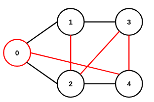
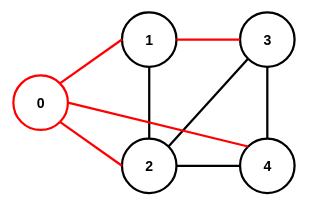

# 4장 그래프
## 4.1 그래프 구현 및 탐색
### 4.1.1 그래프 구현
#### 인접행렬
```C
struct graph{
    int** adjs;
};
```
#### 격자그래프
```C
struct graph{
    int** adjs;
};
```
#### 인접리스트
```C
#include<stdio.h>
#include<stdlib.h>

struct node{
    int v;
    int w;
    struct node* next;
};
struct graph{
    int n;
    struct node** adjs;
};

void   init(struct graph* g,int n);
void  clean(struct graph* g);
void insert(struct graph* g,int u,int v,int w);

int main(void){
    int j;
    int n; int e; scanf("%d %d",&n,&e);
    int u; int v; int w;
    struct graph g;
    init(&g,n);
    for(j=0;j<e;j++){scanf("%d %d %d",&u,&v,&w);insert(&g,u,v,w);};
    clean(&g);
}

void   init(struct graph* g,int n){
    int j;
    g->n=n;
    g->adjs=(struct node**)malloc(sizeof(struct node*)*n);
    for(j=0;j<n;j++){
        g->adjs[j]=(struct node*)malloc(sizeof(struct node));
        g->adjs[j]->v=j;
        g->adjs[j]->w=0;
        g->adjs[j]->next=NULL;
    }
}
void  clean(struct graph* g){
    int j;
    struct node* d;
    struct node* f; // free
    for(j=0;j<g->n;j++){
        d=g->adjs[j];
        while(d!=NULL){
            f=d;
            d=d->next;
            free(f);
        }
    }
    free(g->adjs);
}
void insert(struct graph* g,int u,int v,int w){
    struct node* n=(struct node*)malloc(sizeof(struct node));
    n->v=v;
    n->w=w;
    n->next=g->adjs[u]->next;
    g->adjs[u]->next=n;
}
// insert: 사전순 이웃 노드
// void insert(struct graph* g,int u,int v,int w){
//     struct node* d;
//     struct node* n=(struct node*)malloc(sizeof(struct node)); // new
//     d=g->adjs[u];
//     while((d->next!=NULL)&&(v>(d->next->v))){d=d->next;}
//     n->v=v;
//     n->w=w;
//     n->next=d->next;
//     d->next=n;
// }
```
#### 정적간선풀
```C
#include<stdio.h>
#include<stdlib.h>

struct node{
    int v;
    int w;
    int next;
};
struct graph{
    int n; // number of node
    int e; // number of edge
    int p; // pool index
    int*         adjs;
    struct node* pool;
};

void   init(struct graph* g,int n,int e);
void  clean(struct graph* g);
void insert(struct graph* g,int u,int v,int w);

int main(void){
    int j;
    int n; int e;scanf("%d %d",&n,&e);
    int u; int v; int w;
    struct graph g;
    init(&g,n,e);
    for(j=0;j<e;j++){scanf("%d %d %d",&u,&v,&w);insert(&g,u,v,w);}
    clean(&g);
}

void   init(struct graph* g,int n,int e){
    int j;
    g->n=n;
    g->e=e;
    g->p=0;
    g->adjs=(int*)malloc(sizeof(int)*n);
    g->pool=(struct node*)malloc(sizeof(struct node)*e);
    for(j=0;j<n;j++){g->adjs[j]=-1;}
}
void  clean(struct graph* g){
    free(g->adjs);
    free(g->pool);
}
void insert(struct graph* g,int u,int v,int w){
    g->pool[g->p].v=v;
    g->pool[g->p].w=w;
    g->pool[g->p].next=g->adjs[u];
    g->adjs[u]=(g->p)++;
}
```
### 4.1.2 그래프 탐색
#### 인접행렬 거듭제곱
$\mathbf{A}^k_{i,j}$: 노드 $i$에서 $j$로 $k$개의 간선을 거치는 경로 개수(unweighted graph)  
$\because\mathbf{A}\mathbf{A}_{i,j}=\displaystyle\sum_{m=0}^{n-1}\mathbf{A}_{i,m}\times\mathbf{A}_{m,j}$  
#### DFS


#### DFS: 재귀
```C
#include<stdio.h>
#include<stdlib.h>

#define NOTVIST 0
#define PROCESS 1
#define ALLDONE 2

struct node{
    int v;
    struct node* next;
};
struct graph{
    int n;
    struct node** adjs;
    int*          vist;
};

void    dfs(struct graph* g,int s);
void   init(struct graph* g,int n);
void  clean(struct graph* g);
void insert(struct graph* g,int u,int v);

int main(void){
    int j;
    int n; int e; scanf("%d %d",&n,&e);
    int s; scanf("%d",&s);
    int u; int v;
    struct graph g;
    init(&g,n);
    for(j=0;j<e;j++){
        scanf("%d %d",&u,&v);
        insert(&g,u,v);
        insert(&g,v,u);
    };
    dfs(&g,s);
    clean(&g);
}

void    dfs(struct graph* g,int s){
    struct node* d;
    printf("%d ",s);
    d=g->adjs[s];
    g->vist[s]=PROCESS;
    while((d=d->next)!=NULL){if(g->vist[d->v]==NOTVIST){dfs(g,d->v);}}
    g->vist[s]=ALLDONE;
}
void   init(struct graph* g,int n){
    int j;
    g->n=n;
    g->adjs=(struct node**)malloc(sizeof(struct node*)*n);
    g->vist=         (int*)malloc(sizeof(int)         *n);
    for(j=0;j<n;j++){
        g->adjs[j]=(struct node*)malloc(sizeof(struct node));
        g->adjs[j]->v=j;
        g->adjs[j]->next=NULL;
        g->vist[j]=NOTVIST;
    }
}
void  clean(struct graph* g){
    int j;
    struct node* d;
    struct node* f; // free
    for(j=0;j<g->n;j++){
        d=g->adjs[j];
        while(d!=NULL){
            f=d;
            d=d->next;
            free(f);
        }
    }
    free(g->adjs);
}
void insert(struct graph* g,int u,int v){ // DFS 검증: 사전순 이웃 노드
    struct node* d;
    struct node* n=(struct node*)malloc(sizeof(struct node)); // new
    d=g->adjs[u];
    while((d->next!=NULL)&&(v>(d->next->v))){d=d->next;}
    n->v=v;
    n->next=d->next;
    d->next=n;
}
```
```
$ ./test
5 8 # number of node, edge
0   # start
0 1 
0 2
0 4
1 2
1 3
2 3
2 4
3 4
dfs: 0 1 2 3 4 
```
#### DFS: 스택
```C
void    dfs(struct graph* g,int s){
    struct node* d;
    int* a=(int*)malloc(sizeof(int)*(g->n)); // stack
    int  t=0; // top of stack
    a[t++]=s; // push
    g->vist[s]=ALLDONE;
    while(t>0){
        d=g->adjs[a[--t]]; // pop
        printf("%d ",d->v);
        while((d=d->next)!=NULL){
            if(g->vist[d->v]==NOTVIST){
                g->vist[d->v]=ALLDONE;
                a[t++]=d->v; // push
            }
        }
    }
    free(a);
}
```
```
$ ./test
5 8 # number of node, edge
0   # start
0 1
0 2
0 4
1 2
1 3
2 3
2 4
3 4
dfs: 0 4 3 2 1 # 사전순 탐색 없음(인접리스트 역순)
```
#### BFS


#### BFS: 큐
```C
void    bfs(struct graph* g,int s){
    struct node* d;
    int* q=(int*)malloc(sizeof(int)*(g->n)); // queue
    int f=0; // front of stack
    int r=0; // rear  of stack
    q[r++]=s; // enqueue
    g->vist[s]=ALLDONE;
    while(f<r){
        d=g->adjs[q[f++]]; // dequeue
        printf("%d ",d->v);
        while((d=d->next)!=NULL){
            if(g->vist[d->v]==NOTVIST){
                g->vist[d->v]=ALLDONE;
                q[r++]=d->v; // enqueue
            }
        }
    }
    free(q);
}
```
```
$ ./test
5 8 # number of node, edge
0   # start
0 1
0 2
0 4
1 2
1 3
2 3
2 4
3 4
bfs: 0 1 2 4 3
```
### 4.1.3 격자그래프 탐색
#### BFS
```C
#include<stdio.h>

struct node{
    int r;
    int c;
};

int n;
int m;
int adjs[1000][1000]; // grid
int vist[1000][1000]; // 방문 상태
struct node d[4]={
    {-1, 0},
    { 1, 0},
    { 0,-1},
    { 0, 1}
};

struct node q[1000001]; // queue
int s;                  // front of queue
int e;                  // rear  of queue

void bfs(int r,int c);

int main(void){
    int j;
    int k;
    scanf("%d %d",&n,&m);
    for(j=0;j<n;j++){for(k=0;k<m;k++){scanf("%1d",&adjs[j][k]);}}
    bfs(0,0);
    
    if(vist[n-1][m-1]==0){printf("-1");}
    else                 {printf("%d",vist[n-1][m-1]);}
}

void bfs(int r,int c){
    int k;
    struct node u; // current node
    struct node v; // next node
    q[e  ].r=r;    // enqueue
    q[e++].c=c;    // enqueue
    vist[r][c]=1;
    while(s<e){
        u.r=q[s  ].r; // dequeue
        u.c=q[s++].c; // dequeue
        for(k=0;k<4;k++){
            v.r=u.r+d[k].r;
            v.c=u.c+d[k].c;
            if((v.r>=0&&v.r<n)&&(v.c>=0&&v.c<m)){
                if((adjs[v.r][v.c]==0)&&(vist[v.r][v.c]==0)){
                    vist[v.r][v.c]=vist[u.r][u.c]+1;
                    q[e  ].r=v.r; // enqueue
                    q[e++].c=v.c; // enqueue
                }
            }
        }
    }
}
```
```
$ ./test
6 4
0000
1110
1000
0000
0111
0000
15
```
```
$ ./test
4 4
0100
1100
0000
0000
-1
```


## 4.2 가중치그래프 최적해
### 4.2.1 최단경로
#### 최단경로 예제


#### 데이크스트라
시작점: A  
|S|A|B|C|D|E||
|---|---|---|---|---|---|---|
|$S=\{\}$|**0**|$\infty$|$\infty$|$\infty$|$\infty$|초기화|
|$S=\{A\}$|0|**10**|**5**|$\infty$|$\infty$|B: $\min(\infty,0+10)$<br>C: $\min(\infty,0+5)$|
|$S=\{A,C\}$|0|**8**|5|**14**|**7**|B: $\min(10,5+3)$<br>D: $\min(\infty,5+9)$<br>E: $\min(\infty,5+2)$|
|$S=\{A,C,E\}$|0|8|5|**13**|7|D: $\min(14,7+6)$|
|$S=\{A,C,E,B\}$|0|8|5|**9**|7|C: $\min(5,8+2)$<br>D: $\min(13,8+1)$|
|$S=\{A,C,E,B,D\}$|0|8|5|9|7|E: $\min(7,9+4)$|
#### 데이크스트라
```C
#include<stdio.h>
#include<stdlib.h>

#define INF 1000000000
#define NOTVIST 0
#define ALLDONE 1

struct node{
    int v;
    int w;
    struct node* next;
};
struct graph{
    int n;
    struct node** adjs;
    int*          dist;
    int*          vist;
};

void dijkstra(struct graph* g,int s);
void     init(struct graph* g,int n);
void    clean(struct graph* g);
void   insert(struct graph* g,int u,int v,int w);

int main(void){
    int j;
    int n; int e; scanf("%d %d",&n,&e);
    int s; scanf("%d",&s);
    int u; int v; int w;
    struct graph g;
    init(&g,n);
    for(j=0;j<e;j++){scanf("%d %d %d",&u,&v,&w);insert(&g,u,v,w);}
    dijkstra(&g,s);
    clean(&g);
}

void dijkstra(struct graph* g,int u){
    int j;   // loop variable
    int k;   // loop variable
    int i=u; // min distance index
    int d;   // min distance value
    struct node* b;
    g->dist[u]=0;

    for(j=0;j<g->n;j++){
        // 방문되지 않은 노드 중 비용이 가장 낮은 노드 찾기
        d=INF;
        for(k=0;k<g->n;k++){
            if((g->dist[k]<d)&&(g->vist[k]==NOTVIST)){
                i=k;
                d=g->dist[k];
            }
        }
        b=g->adjs[i];
        d=g->dist[i];
        g->vist[i]=ALLDONE;

        // dist[]<-min(dist[],dist[]+dist[][])
        while((b=b->next)!=NULL){
            if((d+b->w)<(g->dist[b->v])){
                g->dist[b->v]=d+b->w;
            }
        }

        // // 확장 과정 출력
        // printf("expanded: %d, distance: ",i);
        // for(int x=0;x<g->n;x++){
        //     if(g->dist[x]==INF){printf("INF ");}
        //     else               {printf("%d ",g->dist[x]);}
        // }
        // printf("\n");
    }
}
void   init(struct graph* g,int n){
    int j;
    g->n=n;
    g->adjs=(struct node**)malloc(sizeof(struct node*)*n);
    g->dist=         (int*)malloc(sizeof(int)*n);
    g->vist=         (int*)malloc(sizeof(int)*n);
    for(j=0;j<n;j++){
        g->adjs[j]=(struct node*)malloc(sizeof(struct node));
        g->adjs[j]->v=j;
        g->adjs[j]->w=0;
        g->adjs[j]->next=NULL;
        g->dist[j]=INF;
        g->vist[j]=NOTVIST;
    }
}
void  clean(struct graph* g){
    int j;
    struct node* d;
    struct node* f; // free
    for(j=0;j<g->n;j++){
        d=g->adjs[j];
        while(d!=NULL){
            f=d;
            d=d->next;
            free(f);
        }
    }
    free(g->adjs);
    free(g->dist);
    free(g->vist);
}
void insert(struct graph* g,int u,int v,int w){
    struct node* n=(struct node*)malloc(sizeof(struct node));
    n->v=v;
    n->w=w;
    n->next=g->adjs[u]->next;
    g->adjs[u]->next=n;
}
```
```
$ ./test > test.txt
5 10 # number of node, edge
0   # start
0 1 10
0 2 5
1 2 2
1 3 1
2 1 3
2 3 9
2 4 2
3 4 4
4 0 7
4 3 6

$ cat test.txt
expanded: 0, distance: 0 10 5 INF INF 
expanded: 2, distance: 0 8 5 14 7 
expanded: 4, distance: 0 8 5 13 7 
expanded: 1, distance: 0 8 5 9 7 
expanded: 3, distance: 0 8 5 9 7 
```
#### 데이크스트라: 정적 간선 풀, 힙
```C
#include<stdio.h>
#include<stdlib.h>

#define INF 1000000

struct hode{
    int v;
    int d;
};
struct node{
    int v;
    int w;
    int next;
};
struct graph{
    int n;
    int*         adjs;
    int*         dist;
    struct hode* heap;
    struct node* pool;
    int i; // number of heap item
    int p; // pool index
};

void   dijkstra(struct graph* g,int s);
void       init(struct graph* g,int n,int e);
void      clean(struct graph* g);
void     insert(struct graph* g,int u,int v,int w);
void       push(struct graph* g,int v,int d);
struct hode pop(struct graph* g);

int main(void){
    int j;
    int n; int e; scanf("%d %d",&n,&e);
    int s; scanf("%d",&s);
    int u; int v; int w;
    static struct graph g;
    init(&g,n,e);
    for(j=0;j<e;j++){scanf("%d %d %d",&u,&v,&w);insert(&g,u,v,w);}
    dijkstra(&g,s);
    for(j=0;j<n;j++){printf("%d ",g.dist[j]);}
    clean(&g);
}

void   dijkstra(struct graph* g,int s){
    struct hode h;
    int n;
    g->dist[s]=0;
    push(g,s,0);
    while(g->i>0){
        h=pop(g);
        if(g->dist[h.v]<h.d){continue;} // push 이후 갱신: continue
        n=g->adjs[h.v];
        while(n!=0){
            if(g->dist[h.v]+g->pool[n].w<g->dist[g->pool[n].v]){
                g->dist[g->pool[n].v]=g->dist[h.v]+g->pool[n].w;
                push(g,g->pool[n].v,g->dist[g->pool[n].v]);
            }
            n=g->pool[n].next;
        }
    }
}
void       init(struct graph* g,int n,int e){
    int j;
    g->n=n;
    g->i=0;
    g->p=1;
    g->adjs=(int*)malloc(sizeof(int)*n);
    g->dist=(int*)malloc(sizeof(int)*n);
    g->heap=(struct hode*)malloc(sizeof(struct hode)*(2*e+1));
    g->pool=(struct node*)malloc(sizeof(struct node)*(e+1));
    for(j=0;j<n;j++){
        g->adjs[j]=0;
        g->dist[j]=INF;
    }
}
void      clean(struct graph* g){
    free(g->adjs);
    free(g->dist);
    free(g->heap);
    free(g->pool);
}
void     insert(struct graph* g,int u,int v,int w){
    g->pool[g->p].v=v;
    g->pool[g->p].w=w;
    g->pool[g->p].next=g->adjs[u];
    g->adjs[u]=(g->p)++;
}
void       push(struct graph* g,int v,int d){
    int j=++(g->i);
    struct hode t;
    g->heap[j].v=v;
    g->heap[j].d=d;

    while((j>1)&&(g->heap[j].d<g->heap[j/2].d)){
        t=g->heap[j];
        g->heap[j]=g->heap[j/2];
        g->heap[j/2]=t;
        j/=2;
    }
}
struct hode pop(struct graph* g){
    int j=1;
    int c;
    struct hode r=g->heap[j];
    struct hode t;
    g->heap[j]=g->heap[(g->i)--];

    while(2*j<=g->i){
        if(2*j+1<=g->i){c=(g->heap[2*j].d<g->heap[2*j+1].d)?(2*j):(2*j+1);}
        else           {c=2*j;}
        if(g->heap[j].d<=g->heap[c].d){break;}
        t=g->heap[j];
        g->heap[j]=g->heap[c];
        g->heap[c]=t;
        j=c;
    }
    return r;
}
```
```
$ ./test > test.txt
5 10 # number of node, edge
0   # start
0 1 10
0 2 5
1 2 2
1 3 1
2 1 3
2 3 9
2 4 2
3 4 4
4 0 7
4 3 6

$ cat test.txt
0 8 5 9 7 
```
#### 플로이드-워셜
```C
#include<stdio.h>
#include<stdlib.h>

#define INF 1000000000

struct graph{
    int n;
    int** dist;
    int*  d;
};

void   init(struct graph* g,int n);
void  clean(struct graph* g);
void insert(struct graph* g,int u,int v,int w);
void     fw(struct graph* g);

int main(void){
    int j;
    int n; int e; scanf("%d %d",&n,&e);
    int u; int v; int w;
    struct graph g;
    init(&g,n);
    for(j=0;j<e;j++){scanf("%d %d %d",&u,&v,&w);insert(&g,u,v,w);}
    
    fw(&g);
    for(j=0;j<g->n;j++){
    for(k=0;k<g->n;k++){
        if(g->dist[j][k]==INF){printf("INF\t");}
        else                  {printf("%d\t",g->dist[j][k]);}
    }
    
    clean(&g);
}

void   init(struct graph* g,int n){
    int j;
    int k;
    g->n=n;
    g->dist=(int**)malloc(sizeof(int*)*n);
    g->d   =(int*) malloc(sizeof(int) *n*n);
    for(j=0;j<n;j++){g->dist[j]=g->d+j*n;}
    for(j=0;j<n;j++){
    for(k=0;k<n;k++){
        if(j==k){g->dist[j][k]=0;}
        else    {g->dist[j][k]=INF;}
    }}
}
void  clean(struct graph* g){
    free(g->d);
    free(g->dist);
}
void insert(struct graph* g,int u,int v,int w){
    g->dist[u][v]=(w<g->dist[u][v])?w:g->dist[u][v];
}
void     fw(struct graph* g){
    int j; // loop variable
    int k; // loop variable
    int l; // loop variable
    for(j=0;j<g->n;j++){
    for(k=0;k<g->n;k++){
    for(l=0;l<g->n;l++){
        if(g->dist[k][l]>g->dist[k][j]+g->dist[j][l]){
           g->dist[k][l]=g->dist[k][j]+g->dist[j][l];
        }
    }}}
}
```
```
$ ./test > test.txt
5 10 # number of node, edge
0 1 10
0 2 5
1 2 2
1 3 1
2 1 3
2 3 9
2 4 2
3 4 4
4 0 7
4 3 6

$ cat test.txt
0       8       5       9       7
11      0       2       1       4
9       3       0       4       2
11      19      16      0       4
7       15      12      6       0
```
<!-- #### 벨만-포드 -->
### 4.2.2 신장트리
#### 신장트리 입력 예제


<!-- #### Kruskal I -->
#### Kruskal II
```C
#include<stdio.h>
#include<stdlib.h>

struct edge{
    int u;
    int v;
    int w;
};
struct graph{
    int n;
    int e;
    int*         pare; // 분리집합
    struct edge* edgs;
};

int compare(const void* u,const void* v); // 간선 배열 오름차순
void kruskal(struct graph* g);
int  getroot(struct graph* g,int u);
void   unify(struct graph* g,int u,int v);
void    init(struct graph* g,int n,int e);
void   clean(struct graph* g);


int main(void){
    int j;
    int n; int e; scanf("%d %d",&n,&e);
    int u; int v; int w;
    struct graph g;
    init(&g,n,e);
    for(j=0;j<e;j++){
        scanf("%d %d %d",&u,&v,&w);
        g.edgs[j].u=u;
        g.edgs[j].v=v;
        g.edgs[j].w=w;
    }
    kruskal(&g);
    clean(&g);
}

int compare(const void* u,const void* v){
    if((((struct edge*)u)->w)<(((struct edge*)v)->w)){return -1;}
    if((((struct edge*)u)->w)>(((struct edge*)v)->w)){return  1;}
    return 0;
}
void kruskal(struct graph* g){
    int j;
    qsort(&g->edgs[0],g->e,sizeof(struct edge),compare);
    for(j=0;j<g->e;j++){
        if(getroot(g,g->edgs[j].u)!=getroot(g,g->edgs[j].v)){
            unify(g,g->edgs[j].u,g->edgs[j].v);
            printf("edge: %d %d, weight: %d\n",g->edgs[j].u,g->edgs[j].v,g->edgs[j].w);
        }
    }
}
int  getroot(struct graph* g,int u){
    if(g->pare[u]==u){return u;}
    else             {return g->pare[u]=getroot(g,g->pare[u]);}
}
void  unify(struct graph* g,int u,int v){
    g->pare[getroot(g,u)]=getroot(g,v);
}
void    init(struct graph* g,int n,int e){
    int j;
    g->n=n; g->pare=(int*)        malloc(sizeof(int)        *n);
    g->e=e; g->edgs=(struct edge*)malloc(sizeof(struct edge)*e);
    for(j=0;j<n;j++){g->pare[j]=j;}
}
void   clean(struct graph* g){
    free(g->pare);
    free(g->edgs);
}
```
```
$ ./test > test.txt
7 11
0 1 3
0 2 17
0 3 6
1 3 5
1 6 12
2 4 10
2 5 8
3 4 9
4 5 4
4 6 2
5 6 14

$ cat test.txt
edge: 4 6, weight: 2
edge: 0 1, weight: 3
edge: 4 5, weight: 4
edge: 1 3, weight: 5
edge: 2 5, weight: 8
edge: 3 4, weight: 9
```
<!-- #### 프림 -->


## 4.3 고급 그래프 아키텍처
### 4.3.1 다진 트리 과제
#### 분리집합
```C
#include<stdio.h>
#include<stdlib.h>

int* p; // parent

int getroot(int q);
void  unify(int u,int v);

int main(void){
    int j;
    int n; int q; scanf("%d %d",&n,&q);
    int o; int u; int v;
    p=(int*)malloc(sizeof(int)*n);
    for(j=0;j<n;j++){p[j]=j;}
    for(j=0;j<q;j++){
        scanf("%d %d %d",&o,&u,&v);
        if(o==1){
            if(getroot(u)==getroot(v)){printf("YES\n");}
            else                      {printf("NO\n");}
        }
        if(o==2){
            unify(u,v);
        }
    }
    free(p);
}

int getroot(int q){
    if(p[q]==q){return q;}
    else       {return p[q]=getroot(p[q]);}
}
void  unify(int u,int v){
    p[getroot(u)]=getroot(v);
}
```
```
$ ./test > test.txt
5 3 # number of element, query
1 1 2
2 1 2
1 1 2

$ cat test.txt
NO
YES
```
### 4.3.2 DAG
#### 위상정렬 입력 예제


#### 위상정렬
```C
#include<stdio.h>
#include<stdlib.h>

struct node{
    int v;
    struct node* next;
};
struct graph{
    int n;
    struct node** adjs;
    int*          ideg; // 진입 차수
};

void  tsort(struct graph* g); // topological sort
void   init(struct graph* g,int n);
void  clean(struct graph* g);
void insert(struct graph* g,int u,int v);

int main(void){
    int j;
    int n; int e; scanf("%d %d",&n,&e);
    int u; int v;
    struct graph g;
    init(&g,n+1); // 사전순 출력 확장시 1부터 시작(힙)
    for(j=0;j<e;j++){scanf("%d %d",&u,&v); insert(&g,u,v);}
    tsort(&g);
    clean(&g);
}

void tsort(struct graph* g){
    int j;          // loop variable
    int q[g->n];    // queue
    int f=0;        // front
    int r=0;        // rear
    int d;          // node(dequeue)
    struct node* c; // node(인접리스트 포인터)
    
    // enqueue
    for(j=1;j<g->n;j++){if(g->ideg[j]==0){q[r++]=j;}}

    while(f<r){
        d=q[f++]; // dequeue
        printf("%d ",d);
        c=g->adjs[d];
        while((c=c->next)!=NULL){
            g->ideg[c->v]-=1; // 진입 차수 갱신
            if(g->ideg[c->v]==0){q[r++]=c->v;} // enqueue
        }
    }
}
void   init(struct graph* g,int n){
    int j;
    g->n=n;
    g->adjs=(struct node**)malloc(sizeof(struct node*)*n);
    g->ideg=(int*)        malloc(sizeof(int)*         n);
    for(j=0;j<n;j++){
        g->adjs[j]=(struct node*)malloc(sizeof(struct node));
        g->adjs[j]->v=j;
        g->adjs[j]->next=NULL;
        g->ideg[j]=0;
    }
}
void  clean(struct graph* g){
    int j;
    struct node* d;
    struct node* f; // free
    for(j=0;j<g->n;j++){
        d=g->adjs[j];
        while(d!=NULL){
            f=d;
            d=d->next;
            free(f);
        }
    }
    free(g->adjs);
    free(g->ideg);
}
void insert(struct graph* g,int u,int v){
    // 인접리스트 조작
    struct node* n=(struct node*)malloc(sizeof(struct node));
    n->v=v;
    n->next=g->adjs[u]->next;
    g->adjs[u]->next=n;

    // 진입차수 갱신
    g->ideg[v]+=1;
}
```
```
$ ./test > test.txt
10 13 # number of node, edge
1 3
1 4
2 4
2 5
2 10
3 6
3 7
4 6
5 7
6 9
6 10
7 9
8 10

$ cat test.txt
1 2 8 3 5 4 7 6 10 9 
```


<!-- ## 4.4 네트워크 모델링 및 최적화 -->
