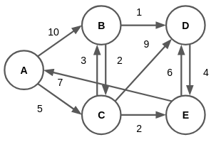

# 6장 그래프
## 6.1 그래프
### 6.1.1 인접행렬
#### 그래프 구현: 인접행렬
```C
#include<stdio.h>
#include<stdlib.h>

# define N 10 // 노드 최대 개수

struct graph{
    unsigned char adjs[N][N];
};

void printgraph(struct graph* g);
void insert(struct graph* g,unsigned char u,unsigned char v,unsigned char w); // u->v

int main(void){
    struct graph* g=(struct graph*)malloc(sizeof(struct graph));
    insert(g,0,4,255);insert(g,4,0,255);
    insert(g,0,1,255);insert(g,1,0,255);
    insert(g,0,2,255);insert(g,2,0,255);
    printgraph(g);
}
void printgraph(struct graph* g){
    unsigned char j;
    unsigned char k;
    for(j=0;j<N;j++){
        printf("node %u's adjs: ",j);
        for(k=0;k<N;k++){if(g->adjs[j][k]!=0){printf("%u ",k);}}
        printf("\n");
    }
}
void insert(struct graph* g,unsigned char u,unsigned char v,unsigned char w){
    g->adjs[u][v]=w;
}
```
```
$ ./test
node 0's adjs: 1 2 4 
node 1's adjs: 0 
node 2's adjs: 0 
node 3's adjs: 
node 4's adjs: 0 
node 5's adjs: 
node 6's adjs: 
node 7's adjs: 
node 8's adjs: 
node 9's adjs: 
```
### 6.1.2 인접리스트
#### 그래프 구현: 인접리스트
```C
#include<stdio.h>
#include<stdlib.h>

#define N 10 // 노드 최대 개수

struct node{
    unsigned char v; // value: 0 ~ N-1, 인접리스트 인덱스 겸용
    unsigned char w; // weight
    struct node* next;
};

struct graph{
    unsigned char n; // 노드 개수
    struct node* adjs[N];
};

void printgraph(struct graph* g);
void init_graph(struct graph* g, unsigned char n);
void insert(struct graph* g,unsigned char u,unsigned char v,unsigned char w); // u->v

int main(void){
    struct graph* g=(struct graph*)malloc(sizeof(struct graph));
    init_graph(g,N);
    insert(g,0,4,255);insert(g,4,0,255);
    insert(g,0,1,255);insert(g,1,0,255);
    insert(g,0,2,255);insert(g,2,0,255);
    printgraph(g);
}
void printgraph(struct graph* g){
    unsigned char j;
    struct node* B;
    for(j=0;j<g->n;j++){
        B=g->adjs[j]; printf("node %u's adjs: ",B->v);
        B=B->next;
        while(B!=NULL){
            printf("%u ",B->v);
            B=B->next;
        }
        printf("\n");
    }
}
void init_graph(struct graph* g,unsigned char n){
    unsigned char j;
    struct node* new;
    for(j=0;j<n;j++){
        new=(struct node*)malloc(sizeof(struct node));
        new->v=j;
        new->w=0;
        new->next=NULL;
        g->adjs[j]=new;
    }
    g->n=n;
}
void insert(struct graph* g,unsigned char u,unsigned char v,unsigned char w){
    struct node* B; // 버퍼
    struct node* V=(struct node*)malloc(sizeof(struct node));
    V->v=v;
    V->w=w;
    V->next=NULL;
    B=g->adjs[u];
    while((B->next!=NULL)&&(v>B->next->v)){B=B->next;}
    V->next=B->next;
    B->next=V;
}
```
```
$ ./test
node 0's adjs: 1 2 4 
node 1's adjs: 0 
node 2's adjs: 0 
node 3's adjs: 
node 4's adjs: 0 
node 5's adjs: 
node 6's adjs: 
node 7's adjs: 
node 8's adjs: 
node 9's adjs: 
```


## 6.2 그래프 탐색
### 6.2.1 DFS
#### DFS
```C
#include<stdio.h>
#include<stdlib.h>

#define N 10 // 노드 최대 개수
#define NOTVIST 0 //
#define PROCESS 1
#define ALLDONE 2 //

struct node{
    unsigned char v; // value: 0 ~ N-1, 인접리스트 인덱스 겸용
    unsigned char w; // weight
    struct node* next;
};

struct graph{
    unsigned char n; // 노드 개수
    struct node*  adjs[N];
    unsigned char vist[N]; // 방문 상태 관리
};

void dfs(struct graph* g,unsigned char s); // s: 시작 노드
void printgraph(struct graph* g);
void init_graph(struct graph* g, unsigned char n);
void insert(struct graph* g,unsigned char u,unsigned char v,unsigned char w); // u->v

int main(void){
    struct graph* g=(struct graph*)malloc(sizeof(struct graph));
    init_graph(g,N);

    insert(g,0,1,255);insert(g,1,0,255);
    insert(g,0,2,255);insert(g,2,0,255);
    insert(g,1,3,255);insert(g,3,1,255);
    insert(g,1,4,255);insert(g,4,1,255);
    insert(g,2,4,255);insert(g,4,2,255);
    insert(g,3,6,255);insert(g,6,3,255);
    insert(g,4,6,255);insert(g,6,4,255);
    insert(g,5,6,255);insert(g,6,5,255);
    printgraph(g);
    printf("dfs: "); dfs(g,0); printf("\n");
}

void dfs(struct graph* g,unsigned char s){
    unsigned char j;
    struct node* b;
    printf("%u ",s);
    b=g->adjs[s];
    g->vist[s]=PROCESS;
    while((b=b->next)!=NULL){
        j=b->v;
        if(g->vist[j]==NOTVIST){dfs(g,j);}
    }
    g->vist[s]=ALLDONE;
}
void printgraph(struct graph* g){
    unsigned char j;
    struct node* B;
    for(j=0;j<g->n;j++){
        B=g->adjs[j]; printf("node %u's adjs: ",B->v);
        B=B->next;
        while(B!=NULL){
            printf("%u ",B->v);
            B=B->next;
        }
        printf("\n");
    }
}
void init_graph(struct graph* g,unsigned char n){
    unsigned char j;
    struct node* new;
    for(j=0;j<n;j++){
        new=(struct node*)malloc(sizeof(struct node));
        new->v=j;
        new->w=0;
        new->next=NULL;
        g->adjs[j]=new;
        g->vist[j]=NOTVIST;
    }
    g->n=n;
}
void insert(struct graph* g,unsigned char u,unsigned char v,unsigned char w){
    struct node* B; // 버퍼
    struct node* V=(struct node*)malloc(sizeof(struct node));
    V->v=v;
    V->w=w;
    V->next=NULL;
    B=g->adjs[u];
    while((B->next!=NULL)&&(v>B->next->v)){B=B->next;}
    V->next=B->next;
    B->next=V;
}
```
```
$ ./test
node 0's adjs: 1 2 
node 1's adjs: 0 3 4 
node 2's adjs: 0 4 
node 3's adjs: 1 6 
node 4's adjs: 1 2 6 
node 5's adjs: 6 
node 6's adjs: 3 4 5 
node 7's adjs: 
node 8's adjs: 
node 9's adjs: 
dfs: 0 1 3 6 4 2 5
```
#### DFS: 스택
```C
void dfs(struct graph* g,unsigned char s){
    unsigned char i=0; // stack index variable
    unsigned char v;   // value buffer
    struct node* b;
    struct node* stack[N*N];
    stack[i++]=g->adjs[s];
    while(i!=0){ // while stack is not empty
        // pop: current node
        b=stack[--i];
        v=b->v;
        if(g->vist[v]==ALLDONE){continue;}
        
        g->vist[v]=ALLDONE;
        printf("%u ",v);
        
        // 인접 노드 확인
        while((b=b->next)!=NULL){
            v=b->v;
            if(g->vist[v]==NOTVIST){
                stack[i++]=g->adjs[v]; // push
            }
        }

    }
}
```
### 6.2.2 BFS
#### BFS: 큐
```C
void bfs(struct graph* g,unsigned char s){
    struct node* b;
    struct node* queue[N*N];
    unsigned char f=0; // queue index variable: front
    unsigned char r=0; // queue index variable: rear
    unsigned char v;   // value buffer

    queue[r++]=g->adjs[s];
    while(f<r){
        b=queue[f++];
        v=b->v;
        if(g->vist[v]==ALLDONE){continue;}
        g->vist[v]=ALLDONE;
        printf("%u ",v);
        while((b=b->next)!=NULL){
            v=b->v;
            if(g->vist[v]==NOTVIST){
                queue[r++]=g->adjs[v];
            }
        }
    }
}
```
```
$ ./test
node 0's adjs: 1 2 
node 1's adjs: 0 3 4 
node 2's adjs: 0 4 
node 3's adjs: 1 6 
node 4's adjs: 1 2 6 
node 5's adjs: 6 
node 6's adjs: 3 4 5 
node 7's adjs: 
node 8's adjs: 
node 9's adjs: 
bfs: 0 1 2 3 4 6 5 
```


## 6.3 최단 경로
<!-- ### 6.3.1 최소 신장 트리 -->
### 6.3.2 다이크스트라
#### 예제: 다이크스트라


시작점: A  
|S|A|B|C|D|E||
|---|---|---|---|---|---|---|
|$S=\{\}$|**0**|$\infty$|$\infty$|$\infty$|$\infty$|초기화|
|$S=\{A\}$|0|**10**|**5**|$\infty$|$\infty$|B: $\min(\infty,0+10)$<br>C: $\min(\infty,0+5)$|
|$S=\{A,C\}$|0|**8**|5|**14**|**7**|B: $\min(10,5+3)$<br>D: $\min(\infty,5+9)$<br>E: $\min(\infty,5+2)$|
|$S=\{A,C,E\}$|0|8|5|**13**|7|D: $\min(14,7+6)$|
|$S=\{A,C,E,B\}$|0|8|5|**9**|7|C: $\min(5,8+2)$<br>D: $\min(13,8+1)$|
|$S=\{A,C,E,B,D\}$|0|8|5|9|7|E: $\min(7,9+4)$|
#### 다이크스트라
```C
#include<stdio.h>
#include<stdlib.h>

#define N 5 // 노드 최대 개수
#define INF 255
#define NOTVIST 0
#define ALLDONE 1

struct node{
    unsigned char v; // value
    unsigned char w; // weight
    struct node* next;
};
struct graph{
    unsigned char n; // 노드 개수
    struct node*  adjs[N];
    unsigned char dist[N];
    unsigned char vist[N];
};

void dijkstra(struct graph* g,unsigned char s);
void init_graph(struct graph* g,unsigned char n);
void init_dist(struct graph* g); // INF로 초기화
void init_vist(struct graph* g);
void insert(struct graph* g,unsigned char u,unsigned char v,unsigned char w);

int main(void){
    struct graph* g=(struct graph*)malloc(sizeof(struct graph));
    init_graph(g,N);
    insert(g,0,1,10);insert(g,0,2,5);
    insert(g,1,2,2); insert(g,1,3,1);
    insert(g,2,1,3); insert(g,2,3,9); insert(g,2,4,2);
    insert(g,3,4,4);
    insert(g,4,0,7); insert(g,4,3,6);
    dijkstra(g,0);
}

void dijkstra(struct graph* g,unsigned char s){
    unsigned char i=s;    // min distance index buffer
    unsigned char d;      // min distance buffer
    unsigned char j;    // loop variable
    unsigned char k;    // loop variable
    init_dist(g); g->dist[s]=0;
    init_vist(g);
    struct node* b;

    for(j=0;j<g->n;j++){
        // 방문되지 않은 노드 중 가장 가까운 노드 찾기
        d=INF;
        for(k=0;k<g->n;k++){
            if((g->dist[k]<d)&&(g->vist[k]==NOTVIST)){
                i=k;
                d=g->dist[k];
            }
        }
        b=g->adjs[i];
        d=g->dist[i];
        g->vist[i]=ALLDONE;
        
        // dist[]<-min(dist[],dist[]+dist[][])
        while((b=b->next)!=NULL){
            if(d+b->w<g->dist[b->v]){
                g->dist[b->v]=d+b->w;
            }
        }

        printf("expanded: %u, distance: ",i);
        for(unsigned char x=0;x<N;x++){printf("%u ",g->dist[x]);}printf("\n");

    }
}
void init_graph(struct graph* g,unsigned char n){
    unsigned char j;
    struct node* new;
    for(j=0;j<n;j++){
        new=(struct node*)malloc(sizeof(struct node));
        new->v=j;
        new->w=0;
        new->next=NULL;
        g->adjs[j]=new;
        g->dist[j]=INF;
        g->vist[j]=NOTVIST;
    }
    g->n=n;
}
void init_dist(struct graph* g){
    unsigned char j;
    for(j=0;j<g->n;j++){
        g->dist[j]=INF;
    }
}
void init_vist(struct graph* g){
    unsigned char j;
    for(j=0;j<g->n;j++){
        g->vist[j]=NOTVIST;
    }
}
void insert(struct graph* g,unsigned char u,unsigned char v,unsigned char w){
    struct node* B;
    struct node* V=(struct node*)malloc(sizeof(struct node));
    V->v=v;
    V->w=w;
    V->next=NULL;
    B=g->adjs[u];
    while((B->next!=NULL)&&(v>B->next->v)){B=B->next;}
    V->next=B->next;
    B->next=V;
}
```
```
$ ./test
expanded: 0, distance: 0 10 5 255 255 
expanded: 2, distance: 0 8 5 14 7 
expanded: 4, distance: 0 8 5 13 7 
expanded: 1, distance: 0 8 5 9 7 
expanded: 3, distance: 0 8 5 9 7
```


<!-- ### 6.3.3 플로이드-워셜 -->
