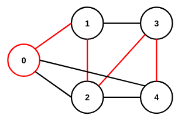
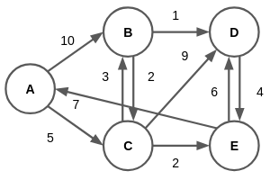

# 6장 그래프
## 6.1 그래프
### 6.1.1 인접행렬
#### 그래프 구현: 인접행렬
```C
struct graph{
    int adjs[N][N];
};
```
#### 인접행렬 거듭제곱
$\mathbf{A}^k_{i,j}$: 노드 $i$에서 $j$로 $k$개의 간선을 거치는 경로 개수(unweighted graph)  
$\because\mathbf{A}\mathbf{A}_{i,j}=\displaystyle\sum_{m=0}^{n-1}\mathbf{A}_{i,m}\times\mathbf{A}_{m,j}$  
### 6.1.2 인접리스트
#### 그래프 구현: 인접리스트
```C
#include<stdio.h>
#include<stdlib.h>

struct node{
    int v;
    int w;
    struct node* next;
};
struct graph{
    int n;
    struct node** adjs;
};

void   init(struct graph* g,int n);
void  clean(struct graph* g);
void insert(struct graph* g,int u,int v,int w);

int main(void){
    int j;
    int n; int e; scanf("%d %d",&n,&e);
    int u; int v; int w;
    struct graph g;
    init(&g,n);
    for(j=0;j<e;j++){scanf("%d %d %d",&u,&v,&w);insert(&g,u,v,w);};
    clean(&g);
}

void   init(struct graph* g,int n){
    int j;
    g->n=n;
    g->adjs=(struct node**)malloc(sizeof(struct node*)*n);
    for(j=0;j<n;j++){
        g->adjs[j]=(struct node*)malloc(sizeof(struct node));
        g->adjs[j]->v=j;
        g->adjs[j]->w=0;
        g->adjs[j]->next=NULL;
    }
}
void  clean(struct graph* g){
    int j;
    struct node* d;
    struct node* f; // free
    for(j=0;j<g->n;j++){
        d=g->adjs[j];
        while(d!=NULL){
            f=d;
            d=d->next;
            free(f);
        }
    }
    free(g->adjs);
}
void insert(struct graph* g,int u,int v,int w){
    struct node* n=(struct node*)malloc(sizeof(struct node));
    n->v=v;
    n->w=w;
    n->next=g->adjs[u]->next;
    g->adjs[u]->next=n;
}
```
#### insert(): 사전순 이웃 노드
```C
void insert(struct graph* g,int u,int v,int w){
    struct node* d;
    struct node* n=(struct node*)malloc(sizeof(struct node)); // new
    d=g->adjs[u];
    while((d->next!=NULL)&&(v>(d->next->v))){d=d->next;}
    n->v=v;
    n->w=w;
    n->next=d->next;
    d->next=n;
}
```
### 6.1.3 정적 간선 풀
#### 그래프 구현: 정적 간선 풀
```C
#include<stdio.h>
#include<stdlib.h>

struct node{
    int v;
    int w;
    int next;
};
struct graph{
    int n; // number of node
    int e; // number of edge
    int p; // pool index
    int*         adjs;
    struct node* pool;
};

void   init(struct graph* g,int n,int e);
void  clean(struct graph* g);
void insert(struct graph* g,int u,int v,int w);

int main(void){
    int j;
    int n; int e;scanf("%d %d",&n,&e);
    int u; int v; int w;
    struct graph g;
    init(&g,n,e);
    for(j=0;j<e;j++){scanf("%d %d %d",&u,&v,&w);insert(&g,u,v,w);}
    clean(&g);
}

void   init(struct graph* g,int n,int e){
    int j;
    g->n=n;
    g->e=e;
    g->p=0;
    g->adjs=(int*)malloc(sizeof(int)*n);
    g->pool=(struct node*)malloc(sizeof(struct node)*e);
    for(j=0;j<n;j++){g->adjs[j]=-1;}
}
void  clean(struct graph* g){
    free(g->adjs);
    free(g->pool);
}
void insert(struct graph* g,int u,int v,int w){
    g->pool[g->p].v=v;
    g->pool[g->p].w=w;
    g->pool[g->p].next=g->adjs[u];
    g->adjs[u]=(g->p)++;
}
```


## 6.2 그래프 탐색
### 6.2.1 DFS
#### DFS


#### DFS: 재귀
```C
#include<stdio.h>
#include<stdlib.h>

#define NOTVIST 0
#define PROCESS 1
#define ALLDONE 2

struct node{
    int v;
    struct node* next;
};
struct graph{
    int n;
    struct node** adjs;
    int*          vist;
};

void    dfs(struct graph* g,int s);
void   init(struct graph* g,int n);
void  clean(struct graph* g);
void insert(struct graph* g,int u,int v);

int main(void){
    int j;
    int n; int e; scanf("%d %d",&n,&e);
    int s; scanf("%d",&s);
    int u; int v;
    struct graph g;
    init(&g,n);
    for(j=0;j<e;j++){
        scanf("%d %d",&u,&v);
        insert(&g,u,v);
        insert(&g,v,u);
    };
    dfs(&g,s);
    clean(&g);
}

void    dfs(struct graph* g,int s){
    struct node* d;
    printf("%d ",s);
    d=g->adjs[s];
    g->vist[s]=PROCESS;
    while((d=d->next)!=NULL){if(g->vist[d->v]==NOTVIST){dfs(g,d->v);}}
    g->vist[s]=ALLDONE;
}
void   init(struct graph* g,int n){
    int j;
    g->n=n;
    g->adjs=(struct node**)malloc(sizeof(struct node*)*n);
    g->vist=         (int*)malloc(sizeof(int)         *n);
    for(j=0;j<n;j++){
        g->adjs[j]=(struct node*)malloc(sizeof(struct node));
        g->adjs[j]->v=j;
        g->adjs[j]->next=NULL;
        g->vist[j]=NOTVIST;
    }
}
void  clean(struct graph* g){
    int j;
    struct node* d;
    struct node* f; // free
    for(j=0;j<g->n;j++){
        d=g->adjs[j];
        while(d!=NULL){
            f=d;
            d=d->next;
            free(f);
        }
    }
    free(g->adjs);
}
void insert(struct graph* g,int u,int v){ // DFS 검증: 사전순 이웃 노드
    struct node* d;
    struct node* n=(struct node*)malloc(sizeof(struct node)); // new
    d=g->adjs[u];
    while((d->next!=NULL)&&(v>(d->next->v))){d=d->next;}
    n->v=v;
    n->next=d->next;
    d->next=n;
}
```
```
$ ./test
5 8 # number of node, edge
0   # start
0 1 
0 2
0 4
1 2
1 3
2 3
2 4
3 4
dfs: 0 1 2 3 4 
```
#### DFS: 스택
```C
void    dfs(struct graph* g,int s){
    struct node* d;
    int* a=(int*)malloc(sizeof(int)*(g->n)); // stack
    int  t=0; // top of stack
    a[t++]=s; // push
    g->vist[s]=ALLDONE;
    while(t>0){
        d=g->adjs[a[--t]]; // pop
        printf("%d ",d->v);
        while((d=d->next)!=NULL){
            if(g->vist[d->v]==NOTVIST){
                g->vist[d->v]=ALLDONE;
                a[t++]=d->v; // push
            }
        }
    }
}
```
```
$ ./test
5 8 # number of node, edge
0   # start
0 1
0 2
0 4
1 2
1 3
2 3
2 4
3 4
dfs: 0 4 3 2 1 # 사전순 탐색 없음(인접리스트 역순)
```
### 6.2.2 BFS
#### BFS


#### BFS: 큐
```C
void    bfs(struct graph* g,int s){
    struct node* d;
    int* q=(int*)malloc(sizeof(int)*(g->n)); // queue
    int f=0; // front of stack
    int r=0; // rear  of stack
    q[r++]=s; // enqueue
    g->vist[s]=ALLDONE;
    while(f<r){
        d=g->adjs[q[f++]]; // dequeue
        printf("%d ",d->v);
        while((d=d->next)!=NULL){
            if(g->vist[d->v]==NOTVIST){
                g->vist[d->v]=ALLDONE;
                q[r++]=d->v; // enqueue
            }
        }
    }
}
```
```
$ ./test
5 8 # number of node, edge
0   # start
0 1
0 2
0 4
1 2
1 3
2 3
2 4
3 4
bfs: 0 1 2 4 3
```


## 6.3 최단 경로
### 6.3.1 데이크스트라
#### 예제: 데이크스트라


시작점: A  
|S|A|B|C|D|E||
|---|---|---|---|---|---|---|
|$S=\{\}$|**0**|$\infty$|$\infty$|$\infty$|$\infty$|초기화|
|$S=\{A\}$|0|**10**|**5**|$\infty$|$\infty$|B: $\min(\infty,0+10)$<br>C: $\min(\infty,0+5)$|
|$S=\{A,C\}$|0|**8**|5|**14**|**7**|B: $\min(10,5+3)$<br>D: $\min(\infty,5+9)$<br>E: $\min(\infty,5+2)$|
|$S=\{A,C,E\}$|0|8|5|**13**|7|D: $\min(14,7+6)$|
|$S=\{A,C,E,B\}$|0|8|5|**9**|7|C: $\min(5,8+2)$<br>D: $\min(13,8+1)$|
|$S=\{A,C,E,B,D\}$|0|8|5|9|7|E: $\min(7,9+4)$|
#### 데이크스트라
```C
#include<stdio.h>
#include<stdlib.h>

#define N 5
#define INF 1000000000
#define NOTVIST 0
#define ALLDONE 1

struct node{
    int v;
    int w;
    struct node* next;
};
struct graph{
    int n; // number of node
    struct node* adjs[N];
    int          dist[N];
    int          vist[N];
};

void dijkstra(struct graph* g,int u);
void     init(struct graph* g,int n);
void   insert(struct graph* g,int u,int v,int w);

int main(void){
    int n=5; // number of node
    struct graph g;
    init(&g,n);
    insert(&g,0,1,10);insert(&g,0,2,5);
    insert(&g,1,2,2); insert(&g,1,3,1);
    insert(&g,2,1,3); insert(&g,2,3,9); insert(&g,2,4,2);
    insert(&g,3,4,4);
    insert(&g,4,0,7); insert(&g,4,3,6);
    dijkstra(&g,0);
}

void dijkstra(struct graph* g,int u){
    int j;   // loop variable
    int k;   // loop variable
    int i=u; // min distance index
    int d;   // min distance value
    struct node* b;
    g->dist[u]=0;

    for(j=0;j<g->n;j++){
        // 방문되지 않은 노드 중 비용이 가장 낮은 노드 찾기
        d=INF;
        for(k=0;k<g->n;k++){
            if((g->dist[k]<d)&&(g->vist[k]==NOTVIST)){
                i=k;
                d=g->dist[k];
            }
        }
        b=g->adjs[i];
        d=g->dist[i];
        g->vist[i]=ALLDONE;

        // dist[]<-min(dist[],dist[]+dist[][])
        while((b=b->next)!=NULL){
            if((d+b->w)<(g->dist[b->v])){
                g->dist[b->v]=d+b->w;
            }
        }

        // 확장 과정 출력
        // printf("expanded: %d, distance: ",i);
        // for(int x=0;x<g->n;x++){
            // if(g->dist[x]==INF){printf("INF ");}
            // else               {printf("%d ",g->dist[x]);}
        // }
        // printf("\n");
    }
}
void     init(struct graph* g,int n){
    int j;
    g->n=n;
    for(j=0;j<n;j++){
        g->adjs[j]=(struct node*)malloc(sizeof(struct node));
        g->adjs[j]->v=j;
        g->adjs[j]->w=0;
        g->adjs[j]->next=NULL;
        g->dist[j]=INF;
        g->vist[j]=NOTVIST;
    }
}
void   insert(struct graph* g,int u,int v,int w){
    struct node* n=(struct node*)malloc(sizeof(struct node)); // new
    n->v=v;
    n->w=w;
    n->next=g->adjs[u]->next;
    g->adjs[u]->next=n;
}
```
```
$ ./test
expanded: 0, distance: 0 10 5 INF INF 
expanded: 2, distance: 0 8 5 14 7 
expanded: 4, distance: 0 8 5 13 7 
expanded: 1, distance: 0 8 5 9 7 
expanded: 3, distance: 0 8 5 9 7 
```
#### 데이크스트라: 정적 간선 풀, 힙
```C
#include<stdio.h>

#define N 20001
#define E 300001
#define INF 3000001

struct hode{
    int v;
    int d;
};
struct node{
    int v;
    int w;
    int next;
};
struct graph{
    int n;
    int         adjs[N];
    int         dist[N];
    struct hode heap[E*3];
    struct node pool[E];
    int i; // number of heap item
    int p; // pool index
};

void   dijkstra(struct graph* g,int s);
void       init(struct graph* g,int n);
void     insert(struct graph* g,int u,int v,int w);
void       push(struct graph* g,int v,int d);
struct hode pop(struct graph* g);

int main(void){
    int j;
    int n; int e; scanf("%d %d",&n,&e);
    int s; scanf("%d",&s);
    int u; int v; int w;
    static struct graph g;
    init(&g,n);
    for(j=0;j<e;j++){scanf("%d %d %d",&u,&v,&w); insert(&g,u,v,w);}
    
    dijkstra(&g,s);
    for(j=0;j<n;j++){printf("%d ",g.dist[j]);}
}

void   dijkstra(struct graph* g,int s){
    struct hode h;
    int n;
    g->dist[s]=0;
    push(g,s,0);
    while(g->i>0){
        h=pop(g);
        if(g->dist[h.v]<h.d){continue;} // push 이후 갱신: continue
        n=g->adjs[h.v];
        while(n!=0){
            if(g->dist[h.v]+g->pool[n].w<g->dist[g->pool[n].v]){
                g->dist[g->pool[n].v]=g->dist[h.v]+g->pool[n].w;
                push(g,g->pool[n].v,g->dist[g->pool[n].v]);
            }
            n=g->pool[n].next;
        }
    }
}
void       init(struct graph* g,int n){
    int j;
    g->n=n;
    g->i=0;
    g->p=1;
    for(j=0;j<n;j++){
        g->adjs[j]=0;
        g->dist[j]=INF;
    }
}
void     insert(struct graph* g,int u,int v,int w){
    g->pool[g->p].v=v;
    g->pool[g->p].w=w;
    g->pool[g->p].next=g->adjs[u];
    g->adjs[u]=(g->p)++;
}
void       push(struct graph* g,int v,int d){
    int j=++(g->i);
    struct hode t;
    g->heap[j].v=v;
    g->heap[j].d=d;

    while((j>1)&&(g->heap[j].d<g->heap[j/2].d)){
        t=g->heap[j];
        g->heap[j]=g->heap[j/2];
        g->heap[j/2]=t;
        j/=2;
    }
}
struct hode pop(struct graph* g){
    int j=1;
    int c;
    struct hode r=g->heap[j];
    struct hode t;
    g->heap[j]=g->heap[(g->i)--];

    while(2*j<=g->i){
        if(2*j+1<=g->i){c=(g->heap[2*j].d<g->heap[2*j+1].d)?(2*j):(2*j+1);}
        else           {c=2*j;}
        if(g->heap[j].d<=g->heap[c].d){break;}
        t=g->heap[j];
        g->heap[j]=g->heap[c];
        g->heap[c]=t;
        j=c;
    }
    return r;
}
```
```
$ ./test > test.txt
5 9 # number of node, edge
0   # start
0 1 10
0 2 5
1 2 2
1 3 1
2 1 3
2 3 9
2 4 2
3 4 4
4 3 6

$ cat test.txt
0 8 5 9 7 
```
### 6.3.2 플로이드-워셜
#### 플로이드-워셜
예제 데이터: 데이크스트라 예제와 같음  
```C
#include<stdio.h>

#define N   5
#define INF 1000000000

struct graph{
    int n;
    int dist[N][N];
};

void   init(struct graph* g,int n);
void insert(struct graph* g,int u,int v,int w);
void     fw(struct graph* g);

int main(void){
    int n=5; // number of node
    struct graph g;
    init(&g,n);
    insert(&g,0,1,10);insert(&g,0,2,5);
    insert(&g,1,2,2); insert(&g,1,3,1);
    insert(&g,2,1,3); insert(&g,2,3,9); insert(&g,2,4,2);
    insert(&g,3,4,4);
    insert(&g,4,0,7); insert(&g,4,3,6);
    fw(&g);
}

void   init(struct graph* g,int n){
    int j; // loop variable
    int k; // loop variable
    g->n=n;
    for(j=0;j<n;j++){
    for(k=0;k<n;k++){
        if(j==k){g->dist[j][k]=0;}
        else    {g->dist[j][k]=INF;}
    }}
}
void insert(struct graph* g,int u,int v,int w){
    if(g->dist[u][v]>w){g->dist[u][v]=w;}
}
void     fw(struct graph* g){
    int j; // loop variable
    int k; // loop variable
    int l; // loop variable
    for(j=0;j<g->n;j++){
    for(k=0;k<g->n;k++){
    for(l=0;l<g->n;l++){
        if(g->dist[k][l]>g->dist[k][j]+g->dist[j][l]){
           g->dist[k][l]=g->dist[k][j]+g->dist[j][l];
        }
    }}}
    // 결과 출력
    // for(j=0;j<g->n;j++){
    // for(k=0;k<g->n;k++){
        // if(g->dist[j][k]==INF){printf("INF\t");}
        // else                  {printf("%d\t",g->dist[j][k]);}
    // }printf("\n");}
}
```
```
$ ./test
from/to A       B       C       D       E
A       0       8       5       9       7
B       11      0       2       1       4
C       9       3       0       4       2
D       11      19      16      0       4
E       7       15      12      6       0
```
<!-- ### 6.3.3 벨만-포드 -->


## 6.4 신장 트리
### 6.4.1 신장 트리
<!-- #### DFS 신장 트리 -->
<!-- #### BFS 신장 트리 -->
#### MST
MST 예제 그래프: Kruskal I, Kruskal II, Prim  


### 6.4.2 Kruskal
#### Kruskal I
```C
#include<stdio.h>
#include<stdlib.h>

#define N 10 // 노드 최대 개수

struct node{
    unsigned char v;
    unsigned char w;
    struct node* next;
};

struct graph{
    unsigned char n;       // 노드 개수
    struct node*  adjs[N]; // 인접리스트
    unsigned char vist[N]; // 방문 상태
};

struct edge{
    unsigned char u;
    unsigned char v;
    unsigned char w;
};

void init_graph(struct graph* g, unsigned char n);
void insert(struct graph* g,unsigned char u,unsigned char v,unsigned char w); // u->v
void cut(struct graph* g,unsigned char u,unsigned char v); // 간선 삭제
void dfs(struct graph* g,unsigned char u); // 연결성 확인
void kruskal(struct graph* g);

int main(void){
    struct graph* g=(struct graph*)malloc(sizeof(struct graph));
    init_graph(g,7);
    insert(g,0,1,3); insert(g,1,0,3);
    insert(g,0,2,17);insert(g,2,0,17);
    insert(g,0,3,6); insert(g,3,0,6);
    insert(g,1,3,5); insert(g,3,1,5);
    insert(g,1,6,12);insert(g,6,1,12);
    insert(g,2,4,10);insert(g,4,2,10);
    insert(g,2,5,8); insert(g,5,2,8);
    insert(g,3,4,9); insert(g,4,3,9);
    insert(g,4,5,4); insert(g,5,4,4);
    insert(g,4,6,2); insert(g,6,4,2);
    insert(g,5,6,14);insert(g,6,5,14);
    kruskal(g);
    return 0;
}

void init_graph(struct graph* g,unsigned char n){
    unsigned char j;
    struct node* new;
    for(j=0;j<n;j++){
        new=(struct node*)malloc(sizeof(struct node));
        new->v=j;
        new->w=0;
        new->next=NULL;
        g->adjs[j]=new;
        g->vist[j]=0;
    }
    g->n=n;
}
void insert(struct graph* g,unsigned char u,unsigned char v,unsigned char w){
    struct node* B; // 버퍼
    struct node* V=(struct node*)malloc(sizeof(struct node));
    V->v=v;
    V->w=w;
    V->next=NULL;
    B=g->adjs[u];
    while((B->next!=NULL)&&(v>B->next->v)){B=B->next;}
    V->next=B->next;
    B->next=V;
}
void dfs(struct graph* g,unsigned char u){
    unsigned char j;
    struct node* B;
    g->vist[u]=1;
    B=g->adjs[u];
    while((B=B->next)!=NULL){
        j=B->v;
        if(g->vist[j]==0){dfs(g,j);}
    }
    g->vist[u]=1;
}
void cut(struct graph* g,unsigned char u,unsigned char v){
    struct node* B;
    B=g->adjs[u];
    while((B->next!=NULL)&&((B->next->v)!=v)){B=B->next;}
    if(B->next!=NULL){B->next=B->next->next;}
}
void kruskal(struct graph* g){
    unsigned char j; // loop variable
    unsigned char k; // loop variable
    struct edge e[N*N];
    struct node* B;
    struct edge t; // swap buffer
    unsigned char c=0; // number of edge
    unsigned char s;   // status: 연결 상태 플래그

    // 간선 배열
    for(j=0;j<g->n;j++){
        B=g->adjs[j];
        while((B=B->next)!=NULL){
            if(j<B->v){ // 무향 그래프: u->v, v->u 간선 중 한 개를 취함
                e[c].u=     j;
                e[c].v=  B->v;
                e[c++].w=B->w;
            }
        }
    }
    // 간선 배열 정렬(내림차순)
    for(j=0;j<c-1;j++){
        for(k=j+1;k<c;k++){
            if(e[j].w<e[k].w){
                t=e[j];
                e[j]=e[k];
                e[k]=t;
            }
        }
    }
    // kruskal: 간선 삭제 - 연결성 확인 - forest일 때 재삽입
    for(j=0;j<c;j++){
        // 간선 삭제
        cut(g,e[j].u,e[j].v);
        cut(g,e[j].v,e[j].u);
        // 연결성 확인
        s=0;
        for(k=0;k<g->n;k++){g->vist[k]=0;}
        dfs(g,0);
        for(k=0;k<g->n;k++){if(g->vist[k]==0){s=1;break;}} // s==1: forest
        // forest일 때 재삽입
        if(s==1){
            insert(g,e[j].u,e[j].v,e[j].w);
            insert(g,e[j].v,e[j].u,e[j].w);
        }
        else{printf("removed: %u - %u, weight: %u\n",e[j].u,e[j].v,e[j].w);}
    }
}
```
```
$ ./test
removed: 0 - 2, weight: 17
removed: 5 - 6, weight: 14
removed: 1 - 6, weight: 12
removed: 2 - 4, weight: 10
removed: 0 - 3, weight: 6
```
#### Kruskal II
```C
#include<stdio.h>
#include<stdlib.h>

#define N 10 // 노드 최대 개수

struct node{
    unsigned char v;
    unsigned char w;
    struct node* next;
};

struct graph{
    unsigned char n;       // 노드 개수
    struct node*  adjs[N]; // 인접리스트
    unsigned char vist[N]; // 방문 상태
    unsigned char pare[N]; // parent: 분리 집합 루트
};

struct edge{
    unsigned char u;
    unsigned char v;
    unsigned char w;
};

void init_graph(struct graph* g, unsigned char n);
void insert(struct graph* g,unsigned char u,unsigned char v,unsigned char w); // u->v
unsigned char getroot(struct graph* g,unsigned char u);     // 분리 집합 조작: 루트 리턴
void unify(struct graph* g,unsigned char u,unsigned char v);// 분리 집합 조작: 합집합
void kruskal(struct graph* g);

int main(void){
    struct graph* g=(struct graph*)malloc(sizeof(struct graph));
    init_graph(g,7);
    insert(g,0,1,3); insert(g,1,0,3);
    insert(g,0,2,17);insert(g,2,0,17);
    insert(g,0,3,6); insert(g,3,0,6);
    insert(g,1,3,5); insert(g,3,1,5);
    insert(g,1,6,12);insert(g,6,1,12);
    insert(g,2,4,10);insert(g,4,2,10);
    insert(g,2,5,8); insert(g,5,2,8);
    insert(g,3,4,9); insert(g,4,3,9);
    insert(g,4,5,4); insert(g,5,4,4);
    insert(g,4,6,2); insert(g,6,4,2);
    insert(g,5,6,14);insert(g,6,5,14);
    kruskal(g);
    return 0;
}

void init_graph(struct graph* g,unsigned char n){
    unsigned char j;
    struct node* new;
    for(j=0;j<n;j++){
        new=(struct node*)malloc(sizeof(struct node));
        new->v=j;
        new->w=0;
        new->next=NULL;
        g->adjs[j]=new;
        g->vist[j]=0;
        g->pare[j]=j; // 자신을 부모로
    }
    g->n=n;
}
void insert(struct graph* g,unsigned char u,unsigned char v,unsigned char w){
    struct node* B; // 버퍼
    struct node* V=(struct node*)malloc(sizeof(struct node));
    V->v=v;
    V->w=w;
    V->next=NULL;
    B=g->adjs[u];
    while((B->next!=NULL)&&(v>B->next->v)){B=B->next;}
    V->next=B->next;
    B->next=V;
}
unsigned char getroot(struct graph* g,unsigned char u){
    if(g->pare[u]==u){return u;}
    else             {return g->pare[u]=getroot(g,g->pare[u]);}
}
void unify(struct graph* g,unsigned char u,unsigned char v){
    unsigned char a=getroot(g,u); // root of u
    unsigned char b=getroot(g,v); // root of v
    if(a!=b){g->pare[a]=b;}
}
void kruskal(struct graph* g){
    unsigned char j; // loop variable
    unsigned char k; // loop variable
    struct edge e[N*N];
    struct node* B;
    struct edge t; // swap buffer
    unsigned char c=0; // number of edge

    // 간선 배열
    for(j=0;j<g->n;j++){
        B=g->adjs[j];
        while((B=B->next)!=NULL){
            if(j<B->v){ // 무향 그래프: u->v, v->u 간선 중 한 개를 취함
                e[c].u=     j;
                e[c].v=  B->v;
                e[c++].w=B->w;
            }
        }
    }
    // 간선 배열 정렬(오름차순)
    for(j=0;j<c-1;j++){
        for(k=j+1;k<c;k++){
            if(e[j].w>e[k].w){
                t=e[j];
                e[j]=e[k];
                e[k]=t;
            }
        }
    }
    // kruskal: 분리 집합
    for(j=0;j<c;j++){
        if(getroot(g,e[j].u)!=getroot(g,e[j].v)){
            unify(g,e[j].u,e[j].v);
            printf("edge: %u - %u, weight: %u\n",e[j].u,e[j].v,e[j].w);
        }
    }
}
```
```
$ ./test
edge: 4 - 6, weight: 2
edge: 0 - 1, weight: 3
edge: 4 - 5, weight: 4
edge: 1 - 3, weight: 5
edge: 2 - 5, weight: 8
edge: 3 - 4, weight: 9
```
<!-- ### 6.4.3 Prim -->
<!-- #### Prim -->


## 6.5 유량
<!-- ### 6.5.1 에드몬드-카프 알고리즘 -->
### 6.5.2 최대 유량
#### 최대 유량
```C
#include <stdio.h>
#include <stdlib.h>

#define N   52
#define INF 2147483647

struct node{
    int v;
    int f; // flow
    int c; // capacity
    struct node* prev;
    struct node* next;
};
struct graph{
    int n; // number of node
    int          prev[N]; // 경로 추적: 이전 정점
    struct node* path[N]; // 경로 추적: 간선
    struct node* adjs[N]; // 인접리스트
};

void   init(struct graph* g,int n);
void insert(struct graph* g,int u,int v,int c);
int    flow(struct graph* g,int s,int e);

int main(void){
    int n=5; // number of node
    struct graph g;
    init(&g,n);
    insert(&g,0,1,3);
    insert(&g,1,2,3);
    insert(&g,2,3,5);
    insert(&g,3,4,4);
    insert(&g,1,4,6);
    printf("%d",flow(&g,0,4));
}

void init(struct graph* g,int n){
    int j;
    g->n=n;
    for(j=0;j<n;j++){
        g->prev[j]=-1;
        g->adjs[j]=(struct node*)malloc(sizeof(struct node));
        g->adjs[j]->v   =j;
        g->adjs[j]->f   =0;
        g->adjs[j]->c   =0;
        g->adjs[j]->prev=NULL;
        g->adjs[j]->next=NULL;
    }
}
void insert(struct graph* g,int u,int v,int c){
    struct node* U=(struct node*)malloc(sizeof(struct node));
    struct node* V=(struct node*)malloc(sizeof(struct node));

    // 인접리스트 삽입
    V->v=v; U->v=u;
    V->f=0; U->f=0;
    V->c=c; U->c=c;
    V->next=g->adjs[u]->next;
    U->next=g->adjs[v]->next;
    g->adjs[u]->next=V;
    g->adjs[v]->next=U;

    // 역방향 노드 포인팅
    V->prev=U;
    U->prev=V;
}
int flow(struct graph* g,int s,int e){
    int j;     // loop variable
    int f=0;   // total flow
    int c;     // current flow
    int q[N];  // linear queue
    int h;     // head of queue
    int t;     // tail of queue
    int          u; // node dummy: number of node
    struct node* d; // node dummy

    while(1){
        // 경로 추적 필드 초기화
        for(j=0;j<g->n;j++){
            g->prev[j]=-1;
            g->path[j]=NULL;
        }

        // enqueue: starting point
        h=0; t=0;
        q[t++]=s;
        g->prev[s]=s;

        // 경로 찾기
        while((h<t)&&(g->prev[e]==-1)){
            u=q[h++]; // dequeue
            d=g->adjs[u];
            while((d=d->next)!=NULL){
                if(((d->c-d->f)>0)&&(g->prev[d->v]==-1)){
                    g->prev[d->v]=u;
                    g->path[d->v]=d;
                    q[t++]=d->v; // enqueue
                }
            }
        }

        // 탐색할 경로 없음
        if(g->prev[e]==-1){break;}

        // 경로 역추적: 잔여 용량(residual) 갱신
        c=INF;
        for(j=e;j!=s;j=g->prev[j]){
            if(c>g->path[j]->c-g->path[j]->f){
                c=g->path[j]->c-g->path[j]->f;
            }
        }

        // 경로 역추적: 유량 갱신
        for(j=e;j!=s;j=g->prev[j]){
            g->path[j]->f      +=c;
            g->path[j]->prev->f-=c; // 역방향 유량 상쇄
        }
        
        // 최대 유량 갱신
        f+=c;
    }
    return f;
}
```
<!-- ### 6.5.3 최대 유량 최소 컷 정리 -->
<!-- ### 6.5.4 최소 비용 최대 유량 -->


## 6.6 DAG
### 6.6.1 위상정렬
#### DAG
DAG: directed acyclic graph  
#### DAG 위상 정렬


```C
#include<stdio.h>
#include<stdlib.h>

#define N 11 // 10+1: 사전순 출력 확장시 1부터 시작(힙)

struct node{
    int v;
    struct node* next;
};
struct graph{
    int n; // number of node
    struct node* adjs[N];
    int          ideg[N]; // indegree: 진입 차수
};

void  tsort(struct graph* g); // topological sort
void   init(struct graph* g,int n);
void insert(struct graph* g,int u,int v);

int main(void){
    int n=10; // number of node
    struct graph g;
    init(&g,n+1); // n+1: 1부터 시작하는 과제 환경
    insert(&g,1,3); insert(&g,1,4);insert(&g,2,4); insert(&g,2,5);insert(&g,2,10);
    insert(&g,3,6); insert(&g,3,7);insert(&g,4,6); insert(&g,5,7);insert(&g,6,9);
    insert(&g,6,10);insert(&g,7,9);insert(&g,8,10);
    tsort(&g);
}

void tsort(struct graph* g){
    int j;          // loop variable
    int q[g->n];    // queue
    int f=0;        // front
    int r=0;        // rear
    int d;          // node(dequeue)
    struct node* c; // node(인접리스트 포인터)
    
    for(j=1;j<g->n;j++){
        if(g->ideg[j]==0){
            q[r++]=j; // enqueue
        }
    }

    while(f<r){
        d=q[f++]; // dequeue
        printf("%d ",d);
        c=g->adjs[d];
        while((c=c->next)!=NULL){
            g->ideg[c->v]-=1; // 진입 차수 갱신
            if(g->ideg[c->v]==0){q[r++]=c->v;} // enqueue
        }
    }
}
void   init(struct graph* g,int n){
    int j;
    g->n=n;
    for(j=0;j<n;j++){
        g->adjs[j]=(struct node*)malloc(sizeof(struct node));
        g->adjs[j]->v=j;
        g->adjs[j]->next=NULL;
        g->ideg[j]=0;
    }
}
void insert(struct graph* g,int u,int v){
    // 인접리스트 조작
    struct node* n=(struct node*)malloc(sizeof(struct node));
    n->v=v;
    n->next=g->adjs[u]->next;
    g->adjs[u]->next=n;

    // 진입차수 갱신
    g->ideg[v]+=1;
}
```
```
$ ./test
1 2 8 3 5 4 7 6 10 9 
```
<!-- ### 6.6.2 SCC -->
<!-- #### SCC -->
<!-- #### 2-SAT -->


## 6.7 격자그래프
### 6.7.1 BFS
#### BFS: 격자그래프 최단경로
```C
#include<stdio.h>

struct node{
    int r;
    int c;
};

int n;
int m;
int adjs[1000][1000]; // grid
int vist[1000][1000]; // 방문 상태
struct node d[4]={
    {-1, 0},
    { 1, 0},
    { 0,-1},
    { 0, 1}
};

struct node q[1000001]; // queue
int s;                  // front of queue
int e;                  // rear  of queue

void bfs(int r,int c);

int main(void){
    int j;
    int k;
    scanf("%d %d",&n,&m);
    for(j=0;j<n;j++){for(k=0;k<m;k++){scanf("%1d",&adjs[j][k]);}}
    bfs(0,0);
    
    if(vist[n-1][m-1]==0){printf("-1");}
    else                 {printf("%d",vist[n-1][m-1]);}
}

void bfs(int r,int c){
    int k;
    struct node u; // current node
    struct node v; // next node
    q[e  ].r=r;    // enqueue
    q[e++].c=c;    // enqueue
    vist[r][c]=1;
    while(s<e){
        u.r=q[s  ].r; // dequeue
        u.c=q[s++].c; // dequeue
        for(k=0;k<4;k++){
            v.r=u.r+d[k].r;
            v.c=u.c+d[k].c;
            if((v.r>=0&&v.r<n)&&(v.c>=0&&v.c<m)){
                if((adjs[v.r][v.c]==0)&&(vist[v.r][v.c]==0)){
                    vist[v.r][v.c]=vist[u.r][u.c]+1;
                    q[e  ].r=v.r; // enqueue
                    q[e++].c=v.c; // enqueue
                }
            }
        }
    }
}
```
```
$ ./test
6 4
0000
1110
1000
0000
0111
0000
15
```
```
$ ./test
4 4
0100
1100
0000
0000
-1
```
