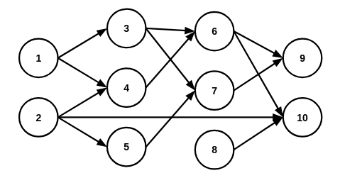

# 6장 그래프
## 6.1 그래프
### 6.1.1 인접행렬
#### 그래프 구현: 인접행렬
```C
struct graph{
    int adjs[N][N];
};
```
#### 인접행렬 거듭제곱
$\mathbf{A}^k_{i,j}$: 노드 $i$에서 $j$로 $k$개의 간선을 거치는 경로 개수(unweighted graph)  
$\because\mathbf{A}\mathbf{A}_{i,j}=\displaystyle\sum_{m=0}^{n-1}\mathbf{A}_{i,m}\times\mathbf{A}_{m,j}$  
### 6.1.2 인접리스트
#### 그래프 구현: 인접리스트
```C
#include<stdio.h>
#include<stdlib.h>

#define N 10

struct node{
    int v; // value: 0 ~ N-1, 인접리스트 인덱스 겸용
    int w; // weight
    struct node* next;
};
struct graph{
    int n; // number of node
    struct node* adjs[N];
};

void   init(struct graph* g,int n);
void insert(struct graph* g,int u,int v,int w);

int main(void){
    int n=10; // number of node
    struct graph g;
    init(&g,n);
}

void   init(struct graph* g,int n){
    int j;
    g->n=n;
    for(j=0;j<n;j++){
        g->adjs[j]=(struct node*)malloc(sizeof(struct node));
        g->adjs[j]->v   =j;
        g->adjs[j]->w   =0;
        g->adjs[j]->next=NULL;
    }
}
void insert(struct graph* g,int u,int v,int w){
    struct node* n=(struct node*)malloc(sizeof(struct node)); // new
    n->v=v;
    n->w=w;
    n->next=g->adjs[u]->next;
    g->adjs[u]->next=n;
}
```
#### insert(): 사전순 이웃 노드
```C
void insert(struct graph* g,int u,int v,int w){
    struct node* b;
    struct node* n=(struct node*)malloc(sizeof(struct node)); // new
    b=g->adjs[u];
    while((b->next!=NULL)&&(v>(b->next->v))){b=b->next;}
    n->v=v;
    n->w=w;
    n->next=b->next;
    b->next=n;
}
```


## 6.2 그래프 탐색
### 6.2.1 DFS
#### DFS


#### DFS
```C
#include<stdio.h>
#include<stdlib.h>

#define N 10
#define NOTVIST 0
#define PROCESS 1
#define ALLDONE 2

struct node{
    int v; // value: 0 ~ N-1, 인접리스트 인덱스 겸용
    struct node* next;
};
struct graph{
    int n; // number of node
    struct node* adjs[N];
    int          vist[N];
};

void    dfs(struct graph* g,int s);
void   init(struct graph* g,int n);
void insert(struct graph* g,int u,int v); // u->v

int main(void){
    int n=10; // number of node
    struct graph g;
    init(&g,n);
    insert(&g,0,1); insert(&g,1,0);
    insert(&g,0,2); insert(&g,2,0);
    insert(&g,0,4); insert(&g,4,0);
    insert(&g,1,2); insert(&g,2,1);
    insert(&g,1,3); insert(&g,3,1);
    insert(&g,2,3); insert(&g,3,2);
    insert(&g,2,4); insert(&g,4,2);
    insert(&g,3,4); insert(&g,4,3);
    printf("dfs: "); dfs(&g,0);
}

void dfs(struct graph* g,int s){
    struct node* b;
    printf("%d ",s);
    b=g->adjs[s];
    g->vist[s]=PROCESS;
    while((b=b->next)!=NULL){if(g->vist[b->v]==NOTVIST){dfs(g,b->v);}}
    g->vist[s]=ALLDONE;
}
void   init(struct graph* g,int n){
    int j;
    g->n=n;
    for(j=0;j<n;j++){
        g->adjs[j]=(struct node*)malloc(sizeof(struct node));
        g->adjs[j]->v   =j;
        g->adjs[j]->next=NULL;
        g->vist[j]=NOTVIST;
    }
}
void insert(struct graph* g,int u,int v){
    struct node* b;
    struct node* n=(struct node*)malloc(sizeof(struct node)); // new
    b=g->adjs[u];
    while((b->next!=NULL)&&(v>(b->next->v))){b=b->next;} // 그래프 탐색: 사전순 이웃 노드
    n->v=v;
    n->next=b->next;
    b->next=n;
}
```
```
$ ./test
dfs: 0 1 2 3 4
```
#### DFS: 스택
```C
void dfs(struct graph* g,int s){
    struct node* b;
    struct node* t[(g->n)];        // tmp(사전순 유지)
    struct node* a[(g->n)*(g->n)]; // stack
    int h=0;                       // head of stack
    int c=0;                       // number of tmp array
    a[h++]=g->adjs[s]; // push
    while(h>0){
        b=a[--h]; // pop
        if(g->vist[b->v]==ALLDONE){continue;}
        g->vist[b->v]=ALLDONE;
        printf("%d ",b->v);
        c=0;
        while((b=b->next)!=NULL){
            if(g->vist[b->v]==NOTVIST){
                t[c++]=g->adjs[b->v];
            }
        }
        while(--c>=0){
            a[h++]=t[c]; // 사전순 유지: 역순 push
        }
    }
}
```
### 6.2.2 BFS
#### BFS


#### BFS: 큐
```C
void bfs(struct graph* g,int s){
    struct node* b;
    struct node* q[(g->n)*(g->n)]; // stack
    int f=0;                       // front
    int r=0;                       // rear
    q[r++]=g->adjs[s]; // enqueue
    while(f<r){
        b=q[f++]; // dequeue
        if(g->vist[b->v]==ALLDONE){continue;}
        g->vist[b->v]=ALLDONE;
        printf("%d ",b->v);
        while((b=b->next)!=NULL){
            if(g->vist[b->v]==NOTVIST){
                q[r++]=g->adjs[b->v]; // enqueue
            }
        }
    }
}
```
```
$ ./test
bfs: 0 1 2 4 3
```


## 6.3 최단 경로
### 6.3.1 데이크스트라
#### 예제: 데이크스트라


시작점: A  
|S|A|B|C|D|E||
|---|---|---|---|---|---|---|
|$S=\{\}$|**0**|$\infty$|$\infty$|$\infty$|$\infty$|초기화|
|$S=\{A\}$|0|**10**|**5**|$\infty$|$\infty$|B: $\min(\infty,0+10)$<br>C: $\min(\infty,0+5)$|
|$S=\{A,C\}$|0|**8**|5|**14**|**7**|B: $\min(10,5+3)$<br>D: $\min(\infty,5+9)$<br>E: $\min(\infty,5+2)$|
|$S=\{A,C,E\}$|0|8|5|**13**|7|D: $\min(14,7+6)$|
|$S=\{A,C,E,B\}$|0|8|5|**9**|7|C: $\min(5,8+2)$<br>D: $\min(13,8+1)$|
|$S=\{A,C,E,B,D\}$|0|8|5|9|7|E: $\min(7,9+4)$|
#### 데이크스트라
```C
#include<stdio.h>
#include<stdlib.h>

#define N 5 // 노드 최대 개수
#define INF 255
#define NOTVIST 0
#define ALLDONE 1

struct node{
    unsigned char v; // value
    unsigned char w; // weight
    struct node* next;
};
struct graph{
    unsigned char n; // 노드 개수
    struct node*  adjs[N];
    unsigned char dist[N];
    unsigned char vist[N];
};

void dijkstra(struct graph* g,unsigned char s);
void init_graph(struct graph* g,unsigned char n);
void init_dist(struct graph* g); // INF로 초기화
void init_vist(struct graph* g);
void insert(struct graph* g,unsigned char u,unsigned char v,unsigned char w);

int main(void){
    struct graph* g=(struct graph*)malloc(sizeof(struct graph));
    init_graph(g,N);
    insert(g,0,1,10);insert(g,0,2,5);
    insert(g,1,2,2); insert(g,1,3,1);
    insert(g,2,1,3); insert(g,2,3,9); insert(g,2,4,2);
    insert(g,3,4,4);
    insert(g,4,0,7); insert(g,4,3,6);
    dijkstra(g,0);
}

void dijkstra(struct graph* g,unsigned char s){
    unsigned char i=s;    // min distance index buffer
    unsigned char d;      // min distance buffer
    unsigned char j;    // loop variable
    unsigned char k;    // loop variable
    init_dist(g); g->dist[s]=0;
    init_vist(g);
    struct node* b;

    for(j=0;j<g->n;j++){
        // 방문되지 않은 노드 중 가장 가까운 노드 찾기
        d=INF;
        for(k=0;k<g->n;k++){
            if((g->dist[k]<d)&&(g->vist[k]==NOTVIST)){
                i=k;
                d=g->dist[k];
            }
        }
        b=g->adjs[i];
        d=g->dist[i];
        g->vist[i]=ALLDONE;
        
        // dist[]<-min(dist[],dist[]+dist[][])
        while((b=b->next)!=NULL){
            if(d+b->w<g->dist[b->v]){
                g->dist[b->v]=d+b->w;
            }
        }

        printf("expanded: %u, distance: ",i);
        for(unsigned char x=0;x<N;x++){printf("%u ",g->dist[x]);}printf("\n");

    }
}
void init_graph(struct graph* g,unsigned char n){
    unsigned char j;
    struct node* new;
    for(j=0;j<n;j++){
        new=(struct node*)malloc(sizeof(struct node));
        new->v=j;
        new->w=0;
        new->next=NULL;
        g->adjs[j]=new;
        g->dist[j]=INF;
        g->vist[j]=NOTVIST;
    }
    g->n=n;
}
void init_dist(struct graph* g){
    unsigned char j;
    for(j=0;j<g->n;j++){
        g->dist[j]=INF;
    }
}
void init_vist(struct graph* g){
    unsigned char j;
    for(j=0;j<g->n;j++){
        g->vist[j]=NOTVIST;
    }
}
void insert(struct graph* g,unsigned char u,unsigned char v,unsigned char w){
    struct node* B;
    struct node* V=(struct node*)malloc(sizeof(struct node));
    V->v=v;
    V->w=w;
    V->next=NULL;
    B=g->adjs[u];
    while((B->next!=NULL)&&(v>B->next->v)){B=B->next;}
    V->next=B->next;
    B->next=V;
}
```
```
$ ./test
expanded: 0, distance: 0 10 5 255 255 
expanded: 2, distance: 0 8 5 14 7 
expanded: 4, distance: 0 8 5 13 7 
expanded: 1, distance: 0 8 5 9 7 
expanded: 3, distance: 0 8 5 9 7
```
### 6.3.2 플로이드-워셜
#### 플로이드-워셜
예제 데이터: 데이크스트라 예제와 같음  
```C
#include<stdio.h>

#define N   5   // 노드 최대 개수
#define INF 255

struct graph{
    unsigned char n; // 노드 개수
    unsigned char dist[N][N];
};

struct graph g;

void init_graph(unsigned char n);
void insert(unsigned char u,unsigned char v,unsigned char w);
void fw(void);

int main(void){
    unsigned char j; // loop variable
    unsigned char k; // loop variable
    unsigned char n; // number of node

    n=5;
    init_graph(n);
    insert(0,1,10);insert(0,2,5);
    insert(1,2,2); insert(1,3,1);
    insert(2,1,3); insert(2,3,9); insert(2,4,2);
    insert(3,4,4);
    insert(4,0,7); insert(4,3,6);
    fw();
    for(j=0;j<n;j++){
        for(k=0;k<n;k++){
            if(g.dist[j][k]==INF){printf("INF\t");}
            else                 {printf("%u\t",g.dist[j][k]);}
        }
        printf("\n");
    }
    return 0;    
}

void init_graph(unsigned char n){
    unsigned char j;
    unsigned char k;
    for(j=0;j<n;j++){
        for(k=0;k<n;k++){
            if(j==k){g.dist[j][k]=0;}
            else    {g.dist[j][k]=INF;}
        }
    }
    g.n=n;
}
void insert(unsigned char u,unsigned char v,unsigned char w){
    if(g.dist[u][v]>w){g.dist[u][v]=w;}
}
void fw(){
    unsigned char j;
    unsigned char k;
    unsigned char l;
    for(j=0;j<g.n;j++){
    for(k=0;k<g.n;k++){
    for(l=0;l<g.n;l++){
        if(g.dist[k][l]>g.dist[k][j]+g.dist[j][l]){
           g.dist[k][l]=g.dist[k][j]+g.dist[j][l];
        }
    }}}
}
```
```
$ ./test
from/to A       B       C       D       E
A       0       8       5       9       7
B       11      0       2       1       4
C       9       3       0       4       2
D       11      19      16      0       4
E       7       15      12      6       0
```
### 6.3.3 DAG 최단경로: 위상정렬
#### DAG
DAG: directed acyclic graph  
#### undirected DAG 위상 정렬


```C
#include<stdio.h>
#include<stdlib.h>

#define N 11

struct node{
    unsigned char v; // value: 0 ~ N-1, 인접리스트 인덱스 겸용
    struct node* next;
};

struct graph{
    unsigned char n; // 노드 개수
    struct node* adjs[N];
    unsigned char ideg[N]; // indegree: 진입 차수
    unsigned char heap[N]; // 최소 힙: 사전순 유지
    unsigned char i;       // item: 엘리먼트 개수
};

void tsort(struct graph* g); // topological sort
void init_graph(struct graph* g, unsigned char n);
void insert(struct graph* g,unsigned char u,unsigned char v); // u->v
void push(struct graph* g,unsigned char v);
unsigned char pop(struct graph* g);

int main(void){
    struct graph* g=(struct graph*)malloc(sizeof(struct graph));
    init_graph(g,11); // 10+1: 1부터 시작하는 과제 환경(힙)
    insert(g,1,3); insert(g,1,4);insert(g,2,4); insert(g,2,5);insert(g,2,10);
    insert(g,3,6); insert(g,3,7);insert(g,4,6); insert(g,5,7);insert(g,6,9);
    insert(g,6,10);insert(g,7,9);insert(g,8,10);
    tsort(g);
}
void tsort(struct graph* g){
    unsigned char j; // loop variable
    unsigned char u;
    struct node* b; // 인접 노드 진입 차수 조작
    
    // 진입 차수 0 노드 push
    for(j=1;j<g->n;j++){
        if(g->ideg[j]==0){
            push(g,j);
        }
    }

    // tsort
    while(g->i>0){
        u=pop(g); // 힙에 의해 사전순 추출
        printf("%u ",u);

        b=g->adjs[u];
        while((b=b->next)!=NULL){
            if((--(g->ideg[b->v]))==0){
                push(g,b->v);
            }
        }
    }
}
void init_graph(struct graph* g,unsigned char n){
    unsigned char j;
    struct node* new;
    for(j=0;j<n;j++){
        new=(struct node*)malloc(sizeof(struct node));
        new->v=j;
        new->next=NULL;
        g->adjs[j]=new;
        g->ideg[j]=0;
    }
    g->n=n;
    g->i=0; // number of heap item
}
void insert(struct graph* g,unsigned char u,unsigned char v){
    struct node* B; // 버퍼
    struct node* V=(struct node*)malloc(sizeof(struct node));
    
    // 진입 차수 갱신
    g->ideg[v]+=1;

    // 삽입
    V->v=v;
    V->next=NULL;
    B=g->adjs[u];
    while((B->next!=NULL)&&(v>B->next->v)){B=B->next;}
    V->next=B->next;
    B->next=V;
}
void push(struct graph* g,unsigned char v){
    unsigned char j; // loop variable
    unsigned char t; // temp variable(swap)
    g->heap[++(g->i)]=v; // 선형 트리 마지막 엘리먼트로 삽입
    j=g->i;

    // heapify
    while((j>1)&&(g->heap[j]<g->heap[j/2])){
        t=g->heap[j];
        g->heap[j]=g->heap[j/2];
        g->heap[j/2]=t;
        j/=2;
    }
}
unsigned char pop(struct graph* g){
    unsigned char r; // root: 리턴값
    unsigned char j; // loop variable
    unsigned char t; // temp variable(swap)
    unsigned char c; // child

    r=g->heap[1]; // 루트
    g->heap[1]=g->heap[(g->i)--]; // 선형 트리 마지막 엘리먼트를 루트로
    j=1;

    // heapify
    while(j*2<=g->i){
        c=j*2; // lchild
        if((c+1<=g->i)&&(g->heap[c+1]<g->heap[c])){
            c+=1; // rchild: j*2+1
        }
        if(g->heap[j]<=g->heap[c]){
            break;
        }
        t=g->heap[j];
        g->heap[j]=g->heap[c];
        g->heap[c]=t;
        j=c;
    }
    return r;
}
```
```
$ ./test
1 2 3 4 5 6 7 8 9 10
```


## 6.4 신장 트리
### 6.4.1 신장 트리
<!-- #### DFS 신장 트리 -->
<!-- #### BFS 신장 트리 -->
#### MST
MST 예제 그래프: Kruskal I, Kruskal II, Prim  


### 6.4.2 Kruskal
#### Kruskal I
```C
#include<stdio.h>
#include<stdlib.h>

#define N 10 // 노드 최대 개수

struct node{
    unsigned char v;
    unsigned char w;
    struct node* next;
};

struct graph{
    unsigned char n;       // 노드 개수
    struct node*  adjs[N]; // 인접리스트
    unsigned char vist[N]; // 방문 상태
};

struct edge{
    unsigned char u;
    unsigned char v;
    unsigned char w;
};

void init_graph(struct graph* g, unsigned char n);
void insert(struct graph* g,unsigned char u,unsigned char v,unsigned char w); // u->v
void cut(struct graph* g,unsigned char u,unsigned char v); // 간선 삭제
void dfs(struct graph* g,unsigned char u); // 연결성 확인
void kruskal(struct graph* g);

int main(void){
    struct graph* g=(struct graph*)malloc(sizeof(struct graph));
    init_graph(g,7);
    insert(g,0,1,3); insert(g,1,0,3);
    insert(g,0,2,17);insert(g,2,0,17);
    insert(g,0,3,6); insert(g,3,0,6);
    insert(g,1,3,5); insert(g,3,1,5);
    insert(g,1,6,12);insert(g,6,1,12);
    insert(g,2,4,10);insert(g,4,2,10);
    insert(g,2,5,8); insert(g,5,2,8);
    insert(g,3,4,9); insert(g,4,3,9);
    insert(g,4,5,4); insert(g,5,4,4);
    insert(g,4,6,2); insert(g,6,4,2);
    insert(g,5,6,14);insert(g,6,5,14);
    kruskal(g);
    return 0;
}

void init_graph(struct graph* g,unsigned char n){
    unsigned char j;
    struct node* new;
    for(j=0;j<n;j++){
        new=(struct node*)malloc(sizeof(struct node));
        new->v=j;
        new->w=0;
        new->next=NULL;
        g->adjs[j]=new;
        g->vist[j]=0;
    }
    g->n=n;
}
void insert(struct graph* g,unsigned char u,unsigned char v,unsigned char w){
    struct node* B; // 버퍼
    struct node* V=(struct node*)malloc(sizeof(struct node));
    V->v=v;
    V->w=w;
    V->next=NULL;
    B=g->adjs[u];
    while((B->next!=NULL)&&(v>B->next->v)){B=B->next;}
    V->next=B->next;
    B->next=V;
}
void dfs(struct graph* g,unsigned char u){
    unsigned char j;
    struct node* B;
    g->vist[u]=1;
    B=g->adjs[u];
    while((B=B->next)!=NULL){
        j=B->v;
        if(g->vist[j]==0){dfs(g,j);}
    }
    g->vist[u]=1;
}
void cut(struct graph* g,unsigned char u,unsigned char v){
    struct node* B;
    B=g->adjs[u];
    while((B->next!=NULL)&&((B->next->v)!=v)){B=B->next;}
    if(B->next!=NULL){B->next=B->next->next;}
}
void kruskal(struct graph* g){
    unsigned char j; // loop variable
    unsigned char k; // loop variable
    struct edge e[N*N];
    struct node* B;
    struct edge t; // swap buffer
    unsigned char c=0; // number of edge
    unsigned char s;   // status: 연결 상태 플래그

    // 간선 배열
    for(j=0;j<g->n;j++){
        B=g->adjs[j];
        while((B=B->next)!=NULL){
            if(j<B->v){ // 무향 그래프: u->v, v->u 간선 중 한 개를 취함
                e[c].u=     j;
                e[c].v=  B->v;
                e[c++].w=B->w;
            }
        }
    }
    // 간선 배열 정렬(내림차순)
    for(j=0;j<c-1;j++){
        for(k=j+1;k<c;k++){
            if(e[j].w<e[k].w){
                t=e[j];
                e[j]=e[k];
                e[k]=t;
            }
        }
    }
    // kruskal: 간선 삭제 - 연결성 확인 - forest일 때 재삽입
    for(j=0;j<c;j++){
        // 간선 삭제
        cut(g,e[j].u,e[j].v);
        cut(g,e[j].v,e[j].u);
        // 연결성 확인
        s=0;
        for(k=0;k<g->n;k++){g->vist[k]=0;}
        dfs(g,0);
        for(k=0;k<g->n;k++){if(g->vist[k]==0){s=1;break;}} // s==1: forest
        // forest일 때 재삽입
        if(s==1){
            insert(g,e[j].u,e[j].v,e[j].w);
            insert(g,e[j].v,e[j].u,e[j].w);
        }
        else{printf("removed: %u - %u, weight: %u\n",e[j].u,e[j].v,e[j].w);}
    }
}
```
```
$ ./test
removed: 0 - 2, weight: 17
removed: 5 - 6, weight: 14
removed: 1 - 6, weight: 12
removed: 2 - 4, weight: 10
removed: 0 - 3, weight: 6
```
#### Kruskal II
```C
#include<stdio.h>
#include<stdlib.h>

#define N 10 // 노드 최대 개수

struct node{
    unsigned char v;
    unsigned char w;
    struct node* next;
};

struct graph{
    unsigned char n;       // 노드 개수
    struct node*  adjs[N]; // 인접리스트
    unsigned char vist[N]; // 방문 상태
    unsigned char pare[N]; // parent: 분리 집합 루트
};

struct edge{
    unsigned char u;
    unsigned char v;
    unsigned char w;
};

void init_graph(struct graph* g, unsigned char n);
void insert(struct graph* g,unsigned char u,unsigned char v,unsigned char w); // u->v
unsigned char getroot(struct graph* g,unsigned char u);     // 분리 집합 조작: 루트 리턴
void unify(struct graph* g,unsigned char u,unsigned char v);// 분리 집합 조작: 합집합
void kruskal(struct graph* g);

int main(void){
    struct graph* g=(struct graph*)malloc(sizeof(struct graph));
    init_graph(g,7);
    insert(g,0,1,3); insert(g,1,0,3);
    insert(g,0,2,17);insert(g,2,0,17);
    insert(g,0,3,6); insert(g,3,0,6);
    insert(g,1,3,5); insert(g,3,1,5);
    insert(g,1,6,12);insert(g,6,1,12);
    insert(g,2,4,10);insert(g,4,2,10);
    insert(g,2,5,8); insert(g,5,2,8);
    insert(g,3,4,9); insert(g,4,3,9);
    insert(g,4,5,4); insert(g,5,4,4);
    insert(g,4,6,2); insert(g,6,4,2);
    insert(g,5,6,14);insert(g,6,5,14);
    kruskal(g);
    return 0;
}

void init_graph(struct graph* g,unsigned char n){
    unsigned char j;
    struct node* new;
    for(j=0;j<n;j++){
        new=(struct node*)malloc(sizeof(struct node));
        new->v=j;
        new->w=0;
        new->next=NULL;
        g->adjs[j]=new;
        g->vist[j]=0;
        g->pare[j]=j; // 자신을 부모로
    }
    g->n=n;
}
void insert(struct graph* g,unsigned char u,unsigned char v,unsigned char w){
    struct node* B; // 버퍼
    struct node* V=(struct node*)malloc(sizeof(struct node));
    V->v=v;
    V->w=w;
    V->next=NULL;
    B=g->adjs[u];
    while((B->next!=NULL)&&(v>B->next->v)){B=B->next;}
    V->next=B->next;
    B->next=V;
}
unsigned char getroot(struct graph* g,unsigned char u){
    if(g->pare[u]==u){return u;}
    else             {return g->pare[u]=getroot(g,g->pare[u]);}
}
void unify(struct graph* g,unsigned char u,unsigned char v){
    unsigned char a=getroot(g,u); // root of u
    unsigned char b=getroot(g,v); // root of v
    if(a!=b){g->pare[a]=b;}
}
void kruskal(struct graph* g){
    unsigned char j; // loop variable
    unsigned char k; // loop variable
    struct edge e[N*N];
    struct node* B;
    struct edge t; // swap buffer
    unsigned char c=0; // number of edge

    // 간선 배열
    for(j=0;j<g->n;j++){
        B=g->adjs[j];
        while((B=B->next)!=NULL){
            if(j<B->v){ // 무향 그래프: u->v, v->u 간선 중 한 개를 취함
                e[c].u=     j;
                e[c].v=  B->v;
                e[c++].w=B->w;
            }
        }
    }
    // 간선 배열 정렬(오름차순)
    for(j=0;j<c-1;j++){
        for(k=j+1;k<c;k++){
            if(e[j].w>e[k].w){
                t=e[j];
                e[j]=e[k];
                e[k]=t;
            }
        }
    }
    // kruskal: 분리 집합
    for(j=0;j<c;j++){
        if(getroot(g,e[j].u)!=getroot(g,e[j].v)){
            unify(g,e[j].u,e[j].v);
            printf("edge: %u - %u, weight: %u\n",e[j].u,e[j].v,e[j].w);
        }
    }
}
```
```
$ ./test
edge: 4 - 6, weight: 2
edge: 0 - 1, weight: 3
edge: 4 - 5, weight: 4
edge: 1 - 3, weight: 5
edge: 2 - 5, weight: 8
edge: 3 - 4, weight: 9
```
<!-- ### 6.4.3 Prim -->
<!-- #### Prim -->


## 6.5 유량
<!-- ### 6.5.1 에드몬드-카프 알고리즘 -->
### 6.5.2 최대 유량
#### 최대 유량
```C
#include <stdio.h>
#include <stdlib.h>

#define N   52
#define INF 2147483647

struct node{
    int v;
    int f; // flow
    int c; // capacity
    struct node* prev;
    struct node* next;
};
struct graph{
    int n; // number of node
    int          prev[N]; // 경로 추적: 이전 정점
    struct node* path[N]; // 경로 추적: 간선
    struct node* adjs[N]; // 인접리스트
};

void   init(struct graph* g,int n);
void insert(struct graph* g,int u,int v,int c);
int    flow(struct graph* g,int s,int e);

int main(void){
    int n=5; // number of node
    struct graph g;
    init(&g,n);
    insert(&g,0,1,3);
    insert(&g,1,2,3);
    insert(&g,2,3,5);
    insert(&g,3,4,4);
    insert(&g,1,4,6);
    printf("%d",flow(&g,0,4));
}

void init(struct graph* g,int n){
    int j;
    g->n=n;
    for(j=0;j<n;j++){
        g->prev[j]=-1;
        g->adjs[j]=(struct node*)malloc(sizeof(struct node));
        g->adjs[j]->v   =j;
        g->adjs[j]->f   =0;
        g->adjs[j]->c   =0;
        g->adjs[j]->prev=NULL;
        g->adjs[j]->next=NULL;
    }
}
void insert(struct graph* g,int u,int v,int c){
    struct node* U=(struct node*)malloc(sizeof(struct node));
    struct node* V=(struct node*)malloc(sizeof(struct node));

    // 인접리스트 삽입
    V->v=v; U->v=u;
    V->f=0; U->f=0;
    V->c=c; U->c=c;
    V->next=g->adjs[u]->next;
    U->next=g->adjs[v]->next;
    g->adjs[u]->next=V;
    g->adjs[v]->next=U;

    // 역방향 노드 포인팅
    V->prev=U;
    U->prev=V;
}
int flow(struct graph* g,int s,int e){
    int j;     // loop variable
    int f=0;   // total flow
    int c;     // current flow
    int q[N];  // linear queue
    int h;     // head of queue
    int t;     // tail of queue
    int          u; // node dummy: number of node
    struct node* d; // node dummy

    while(1){
        // 경로 추적 필드 초기화
        for(j=0;j<g->n;j++){
            g->prev[j]=-1;
            g->path[j]=NULL;
        }

        // enqueue: starting point
        h=0; t=0;
        q[t++]=s;
        g->prev[s]=s;

        // 경로 찾기
        while((h<t)&&(g->prev[e]==-1)){
            u=q[h++]; // dequeue
            d=g->adjs[u];
            while((d=d->next)!=NULL){
                if(((d->c-d->f)>0)&&(g->prev[d->v]==-1)){
                    g->prev[d->v]=u;
                    g->path[d->v]=d;
                    q[t++]=d->v; // enqueue
                }
            }
        }

        // 탐색할 경로 없음
        if(g->prev[e]==-1){break;}

        // 경로 역추적: 잔여 용량(residual) 갱신
        c=INF;
        for(j=e;j!=s;j=g->prev[j]){
            if(c>g->path[j]->c-g->path[j]->f){
                c=g->path[j]->c-g->path[j]->f;
            }
        }

        // 경로 역추적: 유량 갱신
        for(j=e;j!=s;j=g->prev[j]){
            g->path[j]->f      +=c;
            g->path[j]->prev->f-=c; // 역방향 유량 상쇄
        }
        
        // 최대 유량 갱신
        f+=c;
    }
    return f;
}
```
<!-- ### 6.5.3 최대 유량 최소 컷 정리 -->
<!-- ### 6.5.4 최소 비용 최대 유량 -->
